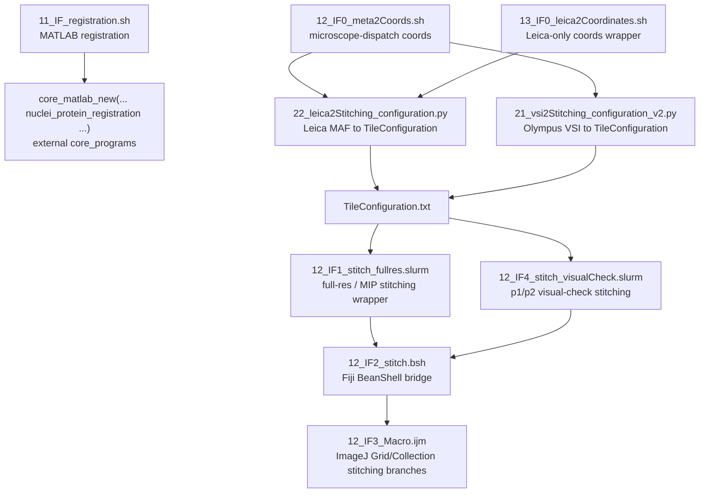

# 02_FovIntegration 代码梳理

本文档记录 `/gpfs/share/home/2401111558/00_scripts/02_auto_starFinder/03.starpipeline.inuse/new_StarFinder/01_upstream_pipeline/02_FovIntegration` 的只读代码梳理结果，重点标记脚本用途、调用关系、活跃状态和疑似冗余备份。

## 总体判断

`02_FovIntegration` 是一个平铺式 pipeline 脚本目录，不是严格模块化代码树。目录内混有活跃 pipeline 脚本、旧版/备份脚本、实验分支脚本、手工辅助工具和分析 notebook。

主流程可以概括为：

## 活跃入口与主调用关系

| 文件 | 状态 | 用途 | 关键调用关系 |
|---|---|---|---|
| `11_IF_registration.sh` | 活跃入口候选 | SLURM array，对 `round001/Position*` 做 IF registration。 | 调 MATLAB `core_matlab_new(..., 'nuclei_protein_registration', ...)`；核心实现位于外部 `core_programs`。 |
| `12_IF0_meta2Coords.sh` | 主要坐标入口 | 根据 `microscope` 参数分流 Leica / Olympus 坐标生成。 | `Leica -> 22_leica2Stitching_configuration.py`；`Olympus -> 21_vsi2Stitching_configuration_v2.py`。 |
| `13_IF0_leica2Coordinates.sh` | Leica 专用坐标入口 | 专门从 Leica `.maf` 和 tif 生成 `TileConfiguration.txt`。 | 直接调用 `22_leica2Stitching_configuration.py`；与 `12_IF0_meta2Coords.sh` 的 Leica 分支功能重叠。 |
| `12_IF1_stitch_fullres.slurm` | stitching 入口 | 用 Fiji/ImageJ 做 full-res 或 MIP stitching。当前活跃段主要处理 `ref-DAPI_MIP`。 | 调 `12_IF2_stitch.bsh`，并传入 `Positions_from_file_MIP`。 |
| `12_IF4_stitch_visualCheck.slurm` | visual check / 分段 stitching | 循环子目录，分别跑 `p1` 和 `p2` 两套 registered config。 | 两轮调用 `12_IF2_stitch.bsh`，分别传入 `Positions_from_file_p1` 和 `Positions_from_file_p2`。 |
| `12_IF2_stitch.bsh` | Fiji bridge | 读取 shell 导出的环境变量，拼接 macro 参数。 | 固定调用 `12_IF3_Macro.ijm`。 |
| `12_IF3_Macro.ijm` | ImageJ macro 核心 | 真正执行 `Grid/Collection stitching` 和部分 `Z Project...`。 | 根据 `STITCH_PATTERN` 选择不同 stitching 分支。 |

## Fiji / ImageJ stitching 分支

`12_IF3_Macro.ijm` 内部包含多个 stitching 模式。当前目录内明确由活跃 wrapper 传入的主要是：

| `STITCH_PATTERN` | 来源 | 用途 |
|---|---|---|
| `Positions_from_file_MIP` | `12_IF1_stitch_fullres.slurm` | 使用 `TileConfiguration.registered.txt` 对 `ref-DAPI_MIP` 做 stitching。 |
| `Positions_from_file_p1` | `12_IF4_stitch_visualCheck.slurm` | 使用 `TileConfiguration.registered.p1.txt` 做第一部分 visual-check stitching。 |
| `Positions_from_file_p2` | `12_IF4_stitch_visualCheck.slurm` | 使用 `TileConfiguration.registered.p2.txt` 做第二部分 visual-check stitching。 |

目录内也保留了其他 macro 分支，例如 `Snake_row_Right_down`、`Positions_from_file`、`Positions_from_file_downsampled`，但在本目录 active wrapper 中没有明确作为当前主路径使用。

## 坐标生成脚本家族

| 文件 | 状态 | 用途 | 备注 |
|---|---|---|---|
| `22_leica2Stitching_configuration.py` | 当前 Leica 主版本 | 解析 Leica `.maf`，匹配 tif，输出 `TileConfiguration.txt`、`tile_layout_leica.png`、`tile_centers_distribution_leica.png`、`tile_summary.csv`。 | 被 `12_IF0_meta2Coords.sh` 和 `13_IF0_leica2Coordinates.sh` 调用。 |
| `22_leica2Stitching_configuration.py.bak` | 冗余备份 | 与 `22_leica2Stitching_configuration.py` 内容完全相同。 | hash 一致、diff 无差异；已被 git 跟踪。 |
| `22_leica2Stitching_configuration.cxz.py` | 实验/分支版本 | Leica 坐标生成变体。 | 主要差异是 tif 匹配策略：按相对父目录 token 匹配，而不是主版的 `*{match_string}*.tif`。本目录未见 active wrapper 调用。 |
| `21_vsi2Stitching_configuration_v2.py` | 当前 Olympus 主版本 | 读取 Olympus `.vsi` metadata，生成 `TileConfiguration.txt`，并输出 tile layout 图和 `tile_summary.csv`。 | 被 `12_IF0_meta2Coords.sh` 的 Olympus 分支调用。 |
| `21_vsi2Stitching_configuration.py` | 旧版/参考实现 | 旧版 Olympus VSI 坐标生成，只生成 `TileConfiguration.txt`，绘图逻辑未实现。 | 当前没有 active wrapper 调用，只在注释里出现。 |

## 辅助工具与非主链对象

| 文件 | 状态 | 用途 / 判断 |
|---|---|---|
| `generate_tile_position.py` | 手工/通用辅助工具 | 根据行列数、起始编号、扫描方式生成 FOV 编号布局 CSV。 |
| `generate_TileConfiguration.py` | 手工/通用辅助工具 | 根据 FOV layout CSV 生成 `TileConfiguration.txt`。与 `generate_tile_position.py` 是数据契约关系，不是程序内 runtime 调用。 |
| `filter_maf.py` | 一次性手工工具倾向 | 默认入口硬编码 `input.maf -> output.maf`，删除 `PositionID 331-488`；目录内未见其他脚本调用。 |
| `Integrative_cells_reads.ipynb` | 分析 notebook | 大型交互分析文件，约 333 MB；只见对 `TileConfiguration` 结果路径的引用，未见其驱动本目录 pipeline 脚本。建议从活跃 pipeline 代码中排除。 |

## 建议状态标记

| 分类 | 文件 |
|---|---|
| `active` | `11_IF_registration.sh`, `12_IF0_meta2Coords.sh`, `13_IF0_leica2Coordinates.sh`, `12_IF1_stitch_fullres.slurm`, `12_IF4_stitch_visualCheck.slurm`, `12_IF2_stitch.bsh`, `12_IF3_Macro.ijm`, `21_vsi2Stitching_configuration_v2.py`, `22_leica2Stitching_configuration.py` |
| `backup-redundant` | `22_leica2Stitching_configuration.py.bak` |
| `legacy-reference` | `21_vsi2Stitching_configuration.py` |
| `experimental-variant` | `22_leica2Stitching_configuration.cxz.py` |
| `manual-utility` | `filter_maf.py`, `generate_tile_position.py`, `generate_TileConfiguration.py` |
| `analysis-notebook` | `Integrative_cells_reads.ipynb` |

## 风险点与后续建议

1. `22_leica2Stitching_configuration.py.bak` 是明确内容级重复，但已经提交到 git；如需清理，应先确认是否保留历史备份策略，再单独删除或迁移。
2. `22_leica2Stitching_configuration.cxz.py` 不是简单备份，而是行为不同的 Leica 分支版本；清理前应确认它是否被外部脚本或历史 batch 使用。
3. `21_vsi2Stitching_configuration.py` 是旧版 Olympus 实现，当前 wrapper 已使用 v2；若要保留，建议在文档中标明 deprecated / legacy。
4. `12_IF1_stitch_fullres.slurm` 和 `12_IF4_stitch_visualCheck.slurm` 内有大量注释掉的旧路径/旧分支。它们不是备份文件，但存在历史逻辑混杂，后续可考虑整理注释或拆成更明确的 wrapper。
5. `Integrative_cells_reads.ipynb` 体积很大，不适合作为 pipeline 代码长期放在脚本目录内；如果它只是分析记录，建议后续迁到 notebook/report 目录或从代码主链文档中排除。

## 已执行的只读验证

- 读取目录顶层文件清单，共 16 个条目。
- 读取主要 `.sh`、`.slurm`、`.bsh`、`.ijm`、`.py` 脚本内容并追踪显式调用关系。
- 对 `22_leica2Stitching_configuration.py` 与 `22_leica2Stitching_configuration.py.bak` 做 hash / diff 判断，确认内容完全相同。
- 对 shell/slurm 入口执行 `bash -n` 语法检查，无语法报错。
- 使用 git 只读命令确认 `22_leica2Stitching_configuration.py.bak` 和 `22_leica2Stitching_configuration.cxz.py` 已被 git 跟踪。

## 环境限制

- 当前环境没有 `rg`，检索改用只读 `grep` / Python 小脚本。
- Python LSP 配置的 `basedpyright-langserver` 未安装，因此没有可用 LSP 符号结果；未修改环境。
