# 02_FovIntegration.new 代码梳理报告

## 概览

本报告记录 `/gpfs/share/home/2401111558/00_scripts/02_auto_starFinder/03.starpipeline.inuse/new_StarFinder/01_upstream_pipeline/02_FovIntegration.new` 下顶层脚本的只读梳理结果，重点是脚本用途、调用关系、可能入口和路径风险。

检查范围包含该目录下 29 个顶层目标文件：`.sh`、`.slurm`、`.bsh`、`.ijm` 和 `.py`。本次未运行 pipeline 脚本，未提交 SLURM，未调用 Fiji/ImageJ、MATLAB 或 Ashlar，也未修改任何源代码文件。

核心结论：`.new` 目录比旧 `02_FovIntegration` 新增了 raw symlink、Ashlar stitching、Ashlar direct stitch、IF raw tileconfig、TE layout 和 TE RGB 等功能脚本；但多个 wrapper 仍硬编码到旧用户路径 `/gpfs/share/home/2300012257/.../02_FovIntegration`，因此当前最大风险是“从 `.new` wrapper 启动，实际运行旧目录代码”。

## 调用关系图

```mermaid
flowchart TD
    accTitle: FovIntegration New Call Graph
    accDescr: 02_FovIntegration.new top-level wrappers call Python, MATLAB, Fiji BeanShell, ImageJ macro, and Ashlar scripts. Red nodes indicate wrappers that currently point to old hardcoded paths.

    raw_sh["10_prepare_raw_data_symlinks.sh"] --> raw_py["10_prepare_raw_data_symlinks.py"]
    reg_sh["11_IF_registration.sh"] --> core_matlab["core_programs/core_matlab_new"]

    meta_sh["12_IF0_meta2Coords.sh"] --> leica_py["22_leica2Stitching_configuration.py"]
    meta_sh --> vsi_v2["21_vsi2Stitching_configuration_v2.py"]
    vsi_sh["12_IF0_vsi2Coordinates.sh"] --> vsi_v2
    leica12_sh["12_IF0_leica2Coordinates.sh"] --> leica_py
    leica13_sh["13_IF0_leica2Coordinates.sh"] --> leica_py

    stitch_sh["12_IF1_stitch.slurm"] --> bsh["12_IF2_stitch.bsh"]
    stitch_full_sh["12_IF1_stitch_fullres.slurm"] --> bsh
    visual_sh["12_IF4_stitch_visualCheck.slurm"] --> bsh
    bsh --> macro["12_IF3_Macro.ijm"]
    macro --> imagej["ImageJ Grid/Collection stitching"]

    ashlar_sh["12_IF5_ashlar.sh"] --> ashlar_py["12_ashlar_stitching.py"]
    ashlar_py --> ashlar_lib["ashlar.reg EdgeAligner/Mosaic/PyramidWriter"]
    direct_sh["14_IF_ashlar_direct_stitch.sh"] --> direct_py["14_ashlar_direct_stitch.py"]
    direct_py --> ashlar_direct_lib["DirectAligner + Ashlar Mosaic/PyramidWriter"]

    if_raw_sh["15_IF_prepare_raw_tileconfig.sh"] --> if_raw_py["15_prepare_if_raw_tileconfig.py"]
    te_layout_sh["16_TE_prepare_layout.sh"] --> te_layout_py["16_prepare_TE_layout.py"]
    te_rgb_sh["17_TE_rgb.sh"] --> te_rgb_py["17_make_TE_rgb.py"]

    classDef local fill:#dcfce7,stroke:#16a34a,color:#14532d
    classDef external fill:#e0f2fe,stroke:#0284c7,color:#0c4a6e
    classDef risky fill:#fee2e2,stroke:#dc2626,color:#7f1d1d
    classDef callee fill:#fef9c3,stroke:#ca8a04,color:#713f12

    class vsi_sh,stitch_sh local
    class core_matlab,imagej,ashlar_lib,ashlar_direct_lib external
    class raw_sh,reg_sh,meta_sh,leica12_sh,leica13_sh,stitch_full_sh,visual_sh,ashlar_sh,direct_sh,if_raw_sh,te_layout_sh,te_rgb_sh risky
    class raw_py,vsi_v2,leica_py,bsh,macro,ashlar_py,direct_py,if_raw_py,te_layout_py,te_rgb_py callee
```



## 主要调用链

| 调用链 | 用途 | 当前风险标记 |
|---|---|---|
| `10_prepare_raw_data_symlinks.sh` -> `10_prepare_raw_data_symlinks.py` | 为 sample 级项目准备 `01_data` 下 raw data symlink，默认 entries 为 `round001,IF,round011` | wrapper 的 `SCRIPT_DIR` 硬编码到旧 `2300012257/.../02_FovIntegration` |
| `11_IF_registration.sh` -> `core_matlab_new(...)` | IF registration SLURM array 入口，按 `round001/Position*` 目录映射 task，调用 MATLAB 核心函数 | `CORE_MATLAB_DIR` 指向旧 `2300012257/.../core_programs`；callee 不在本目录 |
| `12_IF0_vsi2Coordinates.sh` -> `21_vsi2Stitching_configuration_v2.py` | Olympus VSI metadata 到 `TileConfiguration.txt` 的本地 wrapper | 相对安全：用当前脚本目录推导 `.new` 内 Python |
| `12_IF0_meta2Coords.sh` -> `22_leica2Stitching_configuration.py` / `21_vsi2Stitching_configuration_v2.py` | 按 `microscope` 参数在 Leica 与 Olympus 坐标生成间分流 | runtime 调用旧 `2300012257/.../02_FovIntegration`，不是 `.new` 本地脚本 |
| `12_IF0_leica2Coordinates.sh` -> `22_leica2Stitching_configuration.py` | Leica `.maf` 到 `TileConfiguration.txt` 的专用 wrapper | runtime 调用旧目录 Python |
| `13_IF0_leica2Coordinates.sh` -> `22_leica2Stitching_configuration.py` | Leica `.maf` 到 `TileConfiguration.txt` 的另一份专用 wrapper | runtime 调用旧目录 Python |
| `12_IF1_stitch.slurm` -> `12_IF2_stitch.bsh` -> `12_IF3_Macro.ijm` | 通用 Fiji/ImageJ stitching 入口，环境变量传入 `INPUT_DIR`、grid、输出名和 `STITCH_PATTERN` | 相对安全：动态推导 `SCRIPT_DIR` 和 `USER_HOME` |
| `12_IF1_stitch_fullres.slurm` -> `12_IF2_stitch.bsh` -> `12_IF3_Macro.ijm` | fullres/ref-DAPI_MIP stitching wrapper，复制 `TileConfiguration.registered.txt` 后运行 macro | conda、Fiji、默认 `SCRIPT_DIR` 均硬编码旧 `2300012257` 路径 |
| `12_IF4_stitch_visualCheck.slurm` -> `12_IF2_stitch.bsh` -> `12_IF3_Macro.ijm` | visual check / 分段 stitching，使用 `TileConfiguration.registered.p1.txt` 和 `.p2.txt` | conda、Fiji、默认 `SCRIPT_DIR` 均硬编码旧 `2300012257` 路径 |
| `12_IF5_ashlar.sh` -> `12_ashlar_stitching.py` | 从 `TileConfiguration.txt` 用 Ashlar 估计拼接修正，写 2D/3D OME-TIFF 和 `TileConfiguration.registered.txt` | wrapper 调用旧目录 Python |
| `14_IF_ashlar_direct_stitch.sh` -> `14_ashlar_direct_stitch.py` | 复用已有 `TileConfiguration.registered.txt`，跳过 EdgeAligner，直接拼其它 IF channel | wrapper 调用旧目录 Python |
| `15_IF_prepare_raw_tileconfig.sh` -> `15_prepare_if_raw_tileconfig.py` | 根据 ref-DAPI registered config 和 IF registration shift，生成 `TileConfigurationIF.txt`、raw IF channel layout 和 shift table | wrapper 调用旧目录 Python |
| `16_TE_prepare_layout.sh` -> `16_prepare_TE_layout.py` | 从 raw round 目录抽取 TE channels，整理为 `TE-DAPI`、`TE-nt`、`TE-rb` 等子目录并写 manifest | wrapper 调用旧目录 Python |
| `17_TE_rgb.sh` -> `17_make_TE_rgb.py` | 将 stitched TE-nt 与 TE-rb 合成 RGB OME-TIFF | wrapper 调用旧目录 Python |

## 脚本用途与状态标记

| 文件 | 用途 | 建议状态 |
|---|---|---|
| `10_prepare_raw_data_symlinks.py` | 创建 sample-level raw data symlink，不复制大图像数据；会拒绝覆盖非 symlink 目标 | `new-utility-core` |
| `10_prepare_raw_data_symlinks.sh` | `10_prepare_raw_data_symlinks.py` 的 SLURM wrapper | `entrypoint-risky-old-path` |
| `11_IF_registration.sh` | MATLAB IF registration array 入口，调用外部 `core_matlab_new` | `entrypoint-external-core-risky-path` |
| `12_IF0_vsi2Coordinates.sh` | Olympus VSI 坐标生成 wrapper，调用 `.new/21_vsi2Stitching_configuration_v2.py` | `entrypoint-localized` |
| `12_IF0_meta2Coords.sh` | Leica/Olympus 通用坐标 wrapper，按 `microscope` 分流 | `entrypoint-risky-old-path` |
| `12_IF0_leica2Coordinates.sh` | Leica 坐标生成 wrapper | `entrypoint-risky-old-path` |
| `13_IF0_leica2Coordinates.sh` | Leica 坐标生成 wrapper，功能与 `12_IF0_leica2Coordinates.sh` 高度重叠 | `entrypoint-risky-old-path-duplicate-like` |
| `12_IF1_stitch.slurm` | 通用 Fiji stitching wrapper，动态路径版本 | `entrypoint-localized` |
| `12_IF1_stitch_fullres.slurm` | ref-DAPI_MIP fullres stitching wrapper | `entrypoint-risky-old-path` |
| `12_IF4_stitch_visualCheck.slurm` | p1/p2 分段 visual check stitching wrapper | `entrypoint-risky-old-path` |
| `12_IF2_stitch.bsh` | Fiji BeanShell bridge，读取环境变量并调用 `12_IF3_Macro.ijm` | `secondary-callee` |
| `12_IF3_Macro.ijm` | ImageJ macro，包含 `Snake_row_Right_down`、`Positions_from_file`、`Positions_from_file_p1/p2`、`Positions_from_file_downsampled`、`Positions_from_file_MIP` 等分支 | `secondary-callee` |
| `12_ashlar_stitching.py` | 从 `TileConfiguration.txt` 读取 tile 坐标和 TIFF，使用 Ashlar `EdgeAligner` 估计对齐，输出 registered config、edge diagnostics、2D/3D/slice OME-TIFF | `new-functional-core` |
| `12_IF5_ashlar.sh` | `12_ashlar_stitching.py` wrapper | `entrypoint-risky-old-path` |
| `14_ashlar_direct_stitch.py` | 从预先计算的 `TileConfiguration.registered.txt` 直接生成 mosaic，可通过 `channel_from/channel_to` 替换通道路径 | `new-functional-core` |
| `14_IF_ashlar_direct_stitch.sh` | `14_ashlar_direct_stitch.py` wrapper | `entrypoint-risky-old-path` |
| `15_prepare_if_raw_tileconfig.py` | 读取 ref registered config 与 `log_protein_registration.txt` shift，整理 raw IF channel layout，写 `TileConfigurationRef.txt`、`TileConfigurationIF.txt`、`if_registration_shifts.csv` | `new-functional-core` |
| `15_IF_prepare_raw_tileconfig.sh` | `15_prepare_if_raw_tileconfig.py` wrapper | `entrypoint-risky-old-path` |
| `16_prepare_TE_layout.py` | 从 raw round 的 `PositionXXX` 目录按 channel token 抽取 TE channel 文件，写目标 channel 目录和 `extra_layout_manifest.csv` | `new-functional-core` |
| `16_TE_prepare_layout.sh` | `16_prepare_TE_layout.py` wrapper | `entrypoint-risky-old-path` |
| `17_make_TE_rgb.py` | 读取两个 stitched 2D 图像，按红/绿通道合成 RGB OME-TIFF，可做 percentile rescale | `new-functional-core` |
| `17_TE_rgb.sh` | `17_make_TE_rgb.py` wrapper | `entrypoint-risky-old-path` |
| `21_vsi2Stitching_configuration.py` | 旧版 Olympus VSI metadata 到 `TileConfiguration.txt` | `legacy-reference` |
| `21_vsi2Stitching_configuration_v2.py` | 当前 Olympus VSI 坐标生成主版本，附带 layout/centers 可视化和 summary CSV | `coordinate-generator` |
| `22_leica2Stitching_configuration.py` | Leica `.maf` 到 `TileConfiguration.txt` 主版本；`.new` 版将输出文件名写成 `Position{real_id}.tif` | `coordinate-generator-changed` |
| `22_leica2Stitching_configuration.cxz.py` | Leica 实验/变体版本，含 token 匹配逻辑；`.new` 版同样改为 `Position{real_id}.tif` 输出名 | `experimental-variant-changed` |
| `filter_maf.py` | 手工过滤 `.maf` XML 中特定 `PositionID` 范围 | `manual-utility` |
| `generate_tile_position.py` | 生成 FOV layout CSV | `manual-utility` |
| `generate_TileConfiguration.py` | 从 FOV layout CSV 生成 `TileConfiguration.txt` | `manual-utility` |
| `__pycache__/` | Python bytecode cache | `generated-cache` |

## 与旧目录的文件层面差异

`.new` 相比旧 `02_FovIntegration` 新增 15 个顶层文件：

```text
10_prepare_raw_data_symlinks.py
10_prepare_raw_data_symlinks.sh
12_IF0_leica2Coordinates.sh
12_IF0_vsi2Coordinates.sh
12_IF1_stitch.slurm
12_IF5_ashlar.sh
12_ashlar_stitching.py
14_IF_ashlar_direct_stitch.sh
14_ashlar_direct_stitch.py
15_IF_prepare_raw_tileconfig.sh
15_prepare_if_raw_tileconfig.py
16_TE_prepare_layout.sh
16_prepare_TE_layout.py
17_TE_rgb.sh
17_make_TE_rgb.py
```

旧 `02_FovIntegration` 独有对象包括 `22_leica2Stitching_configuration.py.bak` 和 `Integrative_cells_reads.ipynb`。其中 `.bak` 在旧目录中已知与旧主 Leica 脚本完全相同，属于冗余备份；大型 notebook 不属于当前 `.new` 顶层代码链。

共名文件中：`12_IF2_stitch.bsh`、`12_IF3_Macro.ijm`、`21_vsi2Stitching_configuration.py`、`21_vsi2Stitching_configuration_v2.py`、`filter_maf.py`、`generate_tile_position.py`、`generate_TileConfiguration.py` 内容相同。主要差异集中在 wrapper 的路径、`11_IF_registration.sh` 对 symlink 后真实 `round001` 目录的解析，以及 Leica 脚本输出 `TileConfiguration.txt` 时 filename 字段从相对路径改为 `Position{real_id}.tif`。

## 主要风险点

1. `.new` 目录中大量 wrapper 仍指向旧用户 `/gpfs/share/home/2300012257`，包括 conda、Fiji、`SCRIPT_DIR` 和 Python callee。若直接提交运行，可能无法在当前用户环境运行，或者实际跑旧目录代码。
2. `12_IF0_meta2Coords.sh`、`12_IF0_leica2Coordinates.sh`、`13_IF0_leica2Coordinates.sh` 的实际 runtime callee 都不是 `.new` 内同名 Python，因此无法验证 `.new` 版 Leica 脚本改动是否真正生效。
3. `12_IF5_ashlar.sh`、`14_IF_ashlar_direct_stitch.sh`、`15_IF_prepare_raw_tileconfig.sh`、`16_TE_prepare_layout.sh`、`17_TE_rgb.sh` 都是新增 wrapper，但当前硬编码旧目录，导致新增 Python core 虽然存在于 `.new`，wrapper 不一定会调用它们。
4. `12_IF1_stitch_fullres.slurm` 和 `12_IF4_stitch_visualCheck.slurm` 仍硬编码旧 Fiji 路径和旧 `SCRIPT_DIR`；相比之下 `12_IF1_stitch.slurm` 已动态推导路径，更适合作为后续统一模板。
5. `11_IF_registration.sh` 仍依赖外部 `core_programs/core_matlab_new`，本目录不是自包含 pipeline。
6. `12_ashlar_stitching.py`、`14_ashlar_direct_stitch.py`、`15_prepare_if_raw_tileconfig.py` 等新增脚本会产生 TIFF、CSV、TileConfiguration 等输出，后续若要试运行应先明确输出目录，避免覆盖正式结果。

## 建议下一步

1. 先做 wrapper path 审查表，把每个 `.sh/.slurm` 标为 `local .new`、`old 02_FovIntegration`、`old home 2300012257` 或 `external core`。
2. 若准备合并，应优先把新增 wrapper 改成 `SCRIPT_DIR="$(cd "$(dirname "${BASH_SOURCE[0]}")" && pwd)"` 和 `USER_HOME="${SCRIPT_DIR%%/00_scripts/*}"` 这类动态路径模式，参考 `12_IF0_vsi2Coordinates.sh` 和 `12_IF1_stitch.slurm`。
3. 对 `12_IF0_meta2Coords.sh`、`12_IF0_leica2Coordinates.sh`、`13_IF0_leica2Coordinates.sh` 统一 Leica/Olympus 坐标生成入口，减少重复 wrapper。
4. 对 Ashlar 新链条建议先选小样本/单 Position 或明确测试目录，只读检查参数契约后再提交低风险测试作业。
5. 在正式合并前，比较 `22_leica2Stitching_configuration.py` 的 filename 输出改动是否符合后续 Fiji/Ashlar 对输入路径的预期，因为 `.new` 版从 `relative_path` 改为裸 `PositionXXX.tif`。

## 已执行只读验证

- 目录存在性检查：目标目录存在，保存本文档前目标 Markdown 文件不存在。
- 顶层清单检查：`.new` 目录包含 29 个顶层条目，其中 29 个目标脚本/文件和 `__pycache__/`。
- Python 语法检查：13 个 `.py` 文件均通过 `ast.parse`，未写入 `.pyc`。
- shell 语法检查：14 个 `.sh/.slurm` 文件均通过 `bash -n`。
- 未执行 ImageJ/Fiji、MATLAB、Ashlar、SLURM 作业或任何数据处理命令。
