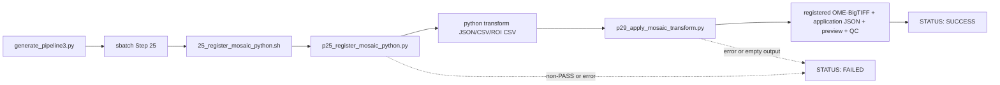

# 25 Python Mosaic Registration 工作流逐块解读

> 本文按 `generate_pipeline3.py` 生成提交命令、`25_register_mosaic_python.sh` wrapper、`p25_register_mosaic_python.py` runner，再到共享 `p29_apply_mosaic_transform.py` 的实际运行顺序解读。所有行号均对应当前源码；本文只读说明代码，不修改业务脚本。

---

## 📋 文档定位

Step 25 是 Python registration backend。它对 fixed/reference mosaic 与 moving mosaic 估计二维平移，先写出 Python backend 的 transform/diagnostic 文件，再在同一个 SLURM job 中调用共享的 Step 29 application runner，把 moving mosaic 反采样到 fixed canvas，并生成 registered image、preview 和 QC 文件。

它不是一个只输出两个 shift 数值的轻量脚本。wrapper 的成功条件包括两部分：

1. `p25_register_mosaic_python.py` 的 registration quality 必须是 `PASS`。
2. 共享 `p29_apply_mosaic_transform.py` 必须成功生成完整应用结果，且 wrapper 最后检查的八项输出都非空。

25 与 26 是两个可并行的 registration backend；如果同时启用，25 不等待 26，26 也不等待 25。两者都在各自 job 内调用同一个 Step 29 runner，之后 Step 28 才负责比较两份 transform。

## 🔗 Runtime call chain



调用关系的关键点是：`p29_apply_mosaic_transform.py` 并不是在 25 完成后由 generator 另起一个 job；它是被 `25_register_mosaic_python.sh` 在同一 job 中直接调用的共享功能层。独立 replay wrapper 的说明见 [`29_apply_mosaic_transform_workflow.md`](29_apply_mosaic_transform_workflow.md)。

## ⚙️ Config/generator entry

### 运行开关与输入配置

`generate_pipeline3.py:255-279` 读取三个 registration 开关：

```python
run_mosaic_registration_python = p.getboolean(
    'run_mosaic_registration_python', fallback=False
)
run_mosaic_registration_matlab = p.getboolean(
    'run_mosaic_registration_matlab', fallback=False
)
run_mosaic_registration_compare = p.getboolean(
    'run_mosaic_registration_compare', fallback=False
)
```

配置示例位于 `batch_config.example.ini:102-113`，三个开关默认都是 `false`。共同输入和 registration 参数位于 `batch_config.example.ini:494-529`，包括：

| 配置项 | 传给 Step 25 的含义 |
| --- | --- |
| `mosaic_registration_fixed_mosaic` | fixed/reference mosaic |
| `mosaic_registration_moving_mosaic` | moving mosaic |
| `mosaic_registration_output_prefix` | 所有 Python backend 输出的公共前缀 |
| `mosaic_registration_overview_downsample` | coarse overview 的下采样因子 |
| `mosaic_registration_overview_block_px` | 分块读取 overview 的源图像 block 大小 |
| `mosaic_registration_roi_size_px` | full-resolution ROI 边长 |
| `mosaic_registration_roi_count` | 请求的 ROI 数量 |
| `mosaic_registration_min_valid_rois` | 最少有效 ROI 数量 |
| `mosaic_registration_upsample_factor` | Python local phase correlation 的亚像素因子 |
| `mosaic_registration_min_overlap_ratio` | 最低重叠比例 |
| `mosaic_registration_max_roi_spread_px` | ROI shift 可接受的最大 spread |
| `mosaic_registration_tile_size_px` | Step 29 registered image tile size |
| `mosaic_registration_interpolation_order` | Step 29 的 `0` nearest 或 `1` linear |
| `mosaic_registration_preview_downsample` | Step 29 QC preview 下采样因子 |
| `mosaic_registration_compression` | Step 29 TIFF compression |
| `mosaic_registration_overwrite` | 是否允许覆盖已有输出 |
| `mosaic_registration_conda_env` | Python registration/application 使用的 conda environment |

### generator 参数组装

`generate_pipeline3.py:436-460` 先构造 shared 参数，再附加 Python 特有的 `upsample_factor`：

```python
mosaic_registration_common_args = (
    ('fixed_mosaic', p['mosaic_registration_fixed_mosaic']),
    ('moving_mosaic', p['mosaic_registration_moving_mosaic']),
    ('output_prefix', p['mosaic_registration_output_prefix']),
    ('script_dir', p['FovIntegration']),
    ('conda_env', p['mosaic_registration_conda_env']),
    # overview / ROI / overlap / output parameters ...
)
mosaic_registration_python_args = format_named_args(
    mosaic_registration_common_args + (
        ('upsample_factor', p['mosaic_registration_upsample_factor']),
    )
)
```

这里 generator 只做配置值到具名 CLI 参数的 plumbing，不推导图像内部结构，也不实现 registration 算法。`script_dir` 被传入 wrapper 后，wrapper 再由它派生 `p25_register_mosaic_python.py` 和 `p29_apply_mosaic_transform.py` 的路径。

### SLURM dependency

`generate_pipeline3.py:1020-1055` 将 Python 与 Matlab registration job 都挂在同一个 `registration_parent_dependency` 上：

```python
registration_parent_dependency = dependency_str

if run_mosaic_registration_python:
    # sbatch ... registration_parent_dependency ... 25_register_mosaic_python.sh
    registration_job_vars.append('MOSAIC_PY_JOB_ID')

if run_mosaic_registration_matlab:
    # sbatch ... registration_parent_dependency ... 26_register_mosaic_matlab.sh
    registration_job_vars.append('MOSAIC_MATLAB_JOB_ID')
```

所以同时启用 25 与 26 时，两者并行；Step 28 若启用，会在 `:1057-1064` 通过两个 job ID 组成 `afterok` dependency 等待它们。Step 25 本身不负责等待或读取 Matlab 输出。

## 🧰 Wrapper 执行顺序：`25_register_mosaic_python.sh`

### 1. SLURM 资源与严格模式：`1-11`

```bash
#SBATCH -J mosaic_reg_python
#SBATCH -o logs025_mosaic_registration/%x_%A.out
#SBATCH -e logs025_mosaic_registration/%x_%A.err
#SBATCH -p C64M256G
#SBATCH -N 1
#SBATCH -c 8
#SBATCH --mem=30G
#SBATCH --time=08:00:00

set -euo pipefail
```

脚本作为一个 8 CPU、30G、8 小时的单节点 job 运行。`set -euo pipefail` 让未处理的命令失败、未定义变量和管道失败都能终止 wrapper；因此 registration 或 application 的任一失败都会阻止后续成功状态输出。

### 2. 帮助文本和 boolean 解析：`13-60`

`print_usage()` 将 `--fixed_mosaic`、`--moving_mosaic`、`--output_prefix` 列为 Required，将算法参数、输出参数和 `--dry_run` 列为 Options。`is_true()` 把 `true/1/yes` 解析为真，把 `false/0/no/空字符串` 解析为假；其它值直接报错并退出。

| 参数组 | 主要参数 | 默认值 |
| --- | --- | --- |
| 输入 | `--fixed_mosaic`, `--moving_mosaic`, `--output_prefix` | 无，必须传入 |
| 环境 | `--script_dir`, `--conda_env` | 当前 `02_FovIntegration`，`ashlar` |
| overview | `--overview_downsample`, `--overview_block_px` | `16`, `4096` |
| ROI | `--roi_size_px`, `--roi_count`, `--min_valid_rois` | `1024`, `9`, `4` |
| Python registration | `--upsample_factor`, `--min_overlap_ratio`, `--max_roi_spread_px` | `20`, `0.2`, `1.0` |
| application | `--tile_size_px`, `--interpolation_order`, `--preview_downsample`, `--compression` | `1024`, `1`, `16`, `zlib` |
| 文件覆盖 | `--overwrite`, `--dry_run` | `false`, `false` |

### 3. 默认值、解析和前置校验：`62-111`

脚本先设置所有默认值，再用 `while [[ $# -gt 0 ]]` 逐个消费具名参数：

```bash
while [[ $# -gt 0 ]]; do
    case "$1" in
        --fixed_mosaic) FIXED_MOSAIC="$2"; shift 2 ;;
        --moving_mosaic) MOVING_MOSAIC="$2"; shift 2 ;;
        --output_prefix) OUTPUT_PREFIX="$2"; shift 2 ;;
        # 其余参数逐项写入对应变量
        -h|--help) print_usage; exit 0 ;;
        *) echo "Error: Unknown parameter: $1" >&2; print_usage >&2; exit 1 ;;
    esac
```

解析完成后只做四项 wrapper 层校验：三个输入/输出前缀必须非空，`interpolation_order` 必须是 `0` 或 `1`。更复杂的数值关系由 Python runner 检查；这避免 wrapper 和 runner 各自维护一套容易漂移的算法校验。

### 4. 输出命名与 runner 路径：`113-122`

```bash
TRANSFORM_JSON="${OUTPUT_PREFIX}.python.transform.json"
SUMMARY_CSV="${OUTPUT_PREFIX}.python.transform.csv"
ROI_CSV="${OUTPUT_PREFIX}.python.roi_diagnostics.csv"
REGISTERED_MOSAIC="${OUTPUT_PREFIX}.python.registered_moving.ome.tif"
APPLICATION_JSON="${OUTPUT_PREFIX}.python.application.json"
PREVIEW_TIF="${OUTPUT_PREFIX}.python.registered_moving.preview.tif"
QC_PNG="${OUTPUT_PREFIX}.python.registration_qc.png"
QC_PDF="${OUTPUT_PREFIX}.python.registration_qc.pdf"
REGISTER_SCRIPT="${SCRIPT_DIR}/p25_register_mosaic_python.py"
APPLY_SCRIPT="${SCRIPT_DIR}/p29_apply_mosaic_transform.py"
```

`.python.` 是 Step 25 backend 的命名空间。Step 26 使用 `.matlab.`，而独立 Step 29 使用调用者提供的 prefix，不自动附加 backend 标签。

### 5. registration 与 application 命令数组：`124-157`

`REGISTER_COMMAND` 把 wrapper 参数映射到 p25 runner 的 `--output_json`、`--output_csv`、`--output_roi_csv` 和 registration 参数。`APPLY_COMMAND` 把相同 transform JSON、fixed/moving 输入和 `.python.*` 输出映射到 p29 runner。

```bash
REGISTER_COMMAND=(
    python -u "$REGISTER_SCRIPT"
    --fixed_mosaic "$FIXED_MOSAIC"
    --moving_mosaic "$MOVING_MOSAIC"
    --output_json "$TRANSFORM_JSON"
    --output_csv "$SUMMARY_CSV"
    --output_roi_csv "$ROI_CSV"
    --overview_downsample "$OVERVIEW_DOWNSAMPLE"
    # 其余 registration 参数...
)

APPLY_COMMAND=(
    python -u "$APPLY_SCRIPT"
    --transform_json "$TRANSFORM_JSON"
    --fixed_mosaic "$FIXED_MOSAIC"
    --moving_mosaic "$MOVING_MOSAIC"
    --output_registered_mosaic "$REGISTERED_MOSAIC"
    # application/QC 参数...
)
```

数组而不是拼接字符串的设计，使带空格的路径仍按一个参数传递；`python -u` 让 SLURM `.out` 中的 runner 日志尽快刷新。

### 6. 命令打印与 dry-run：`159-167`

wrapper 先用 `printf '%q'` 打印两条最终命令，便于复核参数映射。若 `--dry_run true`，在输入文件检查、conda 激活和实际计算前直接退出 0；因此 dry-run 只验证命令拼装，不代表图像、Python 依赖或输出可用。

非 dry-run 时，wrapper 检查 fixed/moving 文件以及两个 runner 文件存在，然后创建 `OUTPUT_PREFIX` 的父目录。

### 7. 环境、顺序、输出检查与状态：`168-186`

```bash
trap 'exit_code=$?; if [[ $exit_code -ne 0 ]]; then
    echo "STATUS: FAILED | SLURM_JOB_NAME=${SLURM_JOB_NAME:-N/A}"
fi' EXIT

source "/gpfs/share/home/${USER}/anaconda3/etc/profile.d/conda.sh"
set +u
conda activate "$CONDA_ENV"
set -u
export OMP_NUM_THREADS="${SLURM_CPUS_PER_TASK:-1}"
export MKL_NUM_THREADS="${SLURM_CPUS_PER_TASK:-1}"
"${REGISTER_COMMAND[@]}"
"${APPLY_COMMAND[@]}"
```

这里是实际执行顺序：

1. 记录失败 trap 与 SLURM 信息。
2. 激活 Python conda environment。
3. 把线程数交给 NumPy/SciPy 依赖使用。
4. 运行 p25 registration。
5. 只有 p25 返回 0 后，才运行 p29 application。
6. 逐项检查八个预期文件为非空。
7. 打印耗时和 `STATUS: SUCCESS`，然后解除 EXIT trap。

因此 wrapper 的成功不是“p25 算出一个 shift”这么简单，而是 registration、transform 写出、full-resolution application、QC 输出全部完成。

## 🧮 Python runner 执行顺序：`p25_register_mosaic_python.py`

### 1. 模块契约与公共常量：`1-19`

模块使用 `SCHEMA_NAME = "starfinder_translation_registration"` 和 `SCHEMA_VERSION = "1.1"`。p29 和 p28 都依赖这套 schema；因此 transform JSON 不是任意包含 `shift_x_px`/`shift_y_px` 的 JSON，而是带有 schema、坐标系、输入 identity 和 quality 的完整记录。

### 2. 参数类型与坐标转换：`21-48`

`parse_bool()` 接受 `true/1/yes` 与 `false/0/no`，保证 wrapper 传下的 boolean 有明确语义。`compose_global_shift()` 将 ROI 局部 shift 加上 fixed 与 moving ROI 原点差：

```python
shift_y = local_shift_yx[0] + fixed_origin_yx[0] - moving_origin_yx[0]
shift_x = local_shift_yx[1] + fixed_origin_yx[1] - moving_origin_yx[1]
```

结果使用 `y, x` 内部顺序保存，但 schema 的 coordinate system 明确记录 `axis_order="xy"`；最终公式为 `x_ref = x_moving + shift_x_px` 与 `y_ref = y_moving + shift_y_px`。

### 3. 分块 TIFF reader：`51-99`

`TiffWindowReader` 只在进入上下文管理器时导入 `tifffile` 与 `zarr`，打开第一个 TIFF series 并要求 shape 恰好是二维。它通过 `series.aszarr()` 与 `zarr.open(..., mode="r")` 读取窗口，不把整张 mosaic 一次性读入内存。

`shape`、`dtype` 和 `read_window()` 都要求 reader 已经进入 `with` 上下文；退出时关闭 zarr store 与 TIFF 文件。这是后续 overview、ROI 和 p29 tile application 能处理大图的基础。

### 4. Overview 构建：`101-161`

`_downsample_block_mean()` 对有限像素做 block mean：无效值不进入 count，边缘 block 通过零填充保持输出尺寸稳定。`build_overview()` 再按对齐的 block 分块读取 source image，将每个 reduced block 放入 overview。

这一步的状态变化是从文件窗口得到两个低分辨率数组；它只用于 coarse shift，不会替代 full-resolution ROI registration。

### 5. Phase correlation 与 overlap：`164-214`

`_phase_correlation()` 调用 `skimage.registration.phase_cross_correlation`。overview 阶段使用 `upsample_factor=1`，ROI 阶段使用用户指定的 `upsample_factor`；可选 mask 和 overlap ratio 用于忽略无效区域。返回 shift、error、phase，并拒绝非二维或非有限 shift。

`_overlap_bounds()` 根据 moving-to-reference shift 计算 fixed 与 moving 的相交矩形，后续用它限制 ROI 候选范围。

### 6. ROI 候选、质量筛选与排序：`217-300`

`_candidate_fixed_origins()` 在 overlap bounds 内构造网格候选 origin。`_select_roi_pairs()` 对每个 fixed origin 推导 moving origin，拒绝越界 ROI，再计算：

| 检查 | 作用 |
| --- | --- |
| `fixed_valid_ratio` / `moving_valid_ratio` | 至少 `0.02` 的有限非零像素 |
| `texture_score` | 两个 ROI 标准差之和，要求有限且大于 0 |
| 排序 | 按 texture score 降序保留前 `roi_count` 个 |

这一步不是直接接受所有空间位置，而是优先选择有有效像素且有纹理的 ROI，避免空白区域主导 local correlation。

### 7. Robust consensus：`303-341`

`robust_shift_consensus()` 先删除非有限 shift，要求有效数量不少于 `min_valid_rois`；以中位数为中心计算每个 ROI 的欧氏距离，再通过 MAD 派生阈值筛选 inlier。如果常规阈值留下的 inlier 不足，则取距离最近的最少 ROI 数量。

最终 shift 是 inlier 的中位数，`spread_px` 是 inlier 到最终中位数的最大距离：

```python
status = "PASS" if spread <= max_spread_px else "REJECTED"
```

这一个 status 决定 main 是否允许写出 transform 文件。

### 8. 坐标合同与 registration 主流程：`344-479`

`_coordinate_system()` 固化 axis order、单位、pixel origin、x/y 方向和 moving-to-reference 公式。

`_register_with_readers()` 的执行顺序是：

1. 从两个 overview 构造 finite/nonzero mask。
2. 对 overview 做 coarse phase correlation。
3. 将 overview shift 乘回 `overview_downsample`，得到 full-resolution coarse shift。
4. 计算 overlap ratio，不足 `min_overlap_ratio` 时失败。
5. 选择并筛选 ROI pairs，不足 `min_valid_rois` 时失败。
6. 对每个 ROI 进行带 Hanning window 的 local phase correlation。
7. 用 `compose_global_shift()` 把 local shift 转成全图坐标。
8. 做 robust consensus，并把每个 ROI 标记为 inlier/outlier。
9. 返回 schema、coordinate system、transform、quality 和 `roi_results`。

### 9. Array API 与文件 API：`482-652`

`register_arrays()` 是面向测试/小对象的内存数组入口；它仍复用 `_register_with_readers()`，但将 `<array>` 作为 identity image，并把 backend/algorithm/parameters 写入 result。

生产 wrapper 调用的是 `register_paths()`：

1. 用 `TiffWindowReader` 打开 fixed/moving。
2. 读取 shape/dtype/size/mtime，构建 initial identity。
3. 分块生成两个 overview 并完成 registration。
4. 在 registration 后再次读取 identity。
5. `_assert_file_identity_unchanged()` 拒绝运行期间发生尺寸、dtype、文件大小或 mtime 变化的输入。
6. 将 canonical identity、Python backend、库版本和参数写入最终 result。

这个 identity 是后续 p28/p29 防止 transform 错配的依据。

### 10. Registration 文件输出：`655-700`

`_ensure_outputs_available()` 在 `overwrite=false` 时拒绝任何已有 JSON/CSV，并创建输出父目录。`write_result_files()` 输出：

| 文件 | 内容 |
| --- | --- |
| `*.python.transform.json` | 完整 schema、identity、transform、quality、ROI 结果 |
| `*.python.transform.csv` | 一行 summary，包括 backend、shift、status、ROI 数量和 spread |
| `*.python.roi_diagnostics.csv` | 每个 ROI 的 origin、local/global shift、质量和 inlier |

### 11. CLI 主流程：`702-756`

`build_parser()` 定义 wrapper 传下的全部底层参数。`main()` 的顺序是：

```python
args = build_parser().parse_args()
result = register_paths(...)
if result["quality"]["status"] != "PASS":
    raise RuntimeError("Registration was rejected: ...")
write_result_files(...)
print("Registration PASS: ...")
```

注意 p25 在质量不是 `PASS` 时先抛错、再写文件；因此 p25 runner 的非 PASS 结果不会产生三份 backend registration 文件。wrapper 的 `set -e` 会因此阻止 p29 被调用。

## 📦 输出与失败契约

### 输出前缀

对公共前缀 `P`，Step 25 期望：

```text
P.python.transform.json
P.python.transform.csv
P.python.roi_diagnostics.csv
P.python.registered_moving.ome.tif
P.python.application.json
P.python.registered_moving.preview.tif
P.python.registration_qc.png
P.python.registration_qc.pdf
```

其中前三项由 p25 写出，后五项由 p29 写出；wrapper 最后实际检查八项。

### 主要失败点

| 阶段 | 失败条件 | 结果 |
| --- | --- | --- |
| 参数 | 缺少三个 required 参数、插值不是 `0/1`、未知 flag | wrapper 退出 |
| 输入 | fixed/moving/runner 缺失、图像非 2D | wrapper 或 p25 失败 |
| overview | downsample/block 非法、overview 无有限非零像素 | p25 失败 |
| registration | overlap 太低、ROI 不足、shift 非有限、spread 超阈值 | p25 返回失败，不进入 p29 |
| identity | registration 期间输入文件发生变化 | p25 失败，不写可信结果 |
| 输出 | overwrite=false 且目标已存在 | p25 或 p29 拒绝覆盖 |
| application | p29 transform contract、采样、QC、发布任一步失败 | wrapper 失败 |
| 完成检查 | 八项输出中任一不存在或为空 | wrapper 失败 |

失败 EXIT trap 打印：

```text
STATUS: FAILED | SLURM_JOB_NAME=...
```

成功必须打印：

```text
STATUS: SUCCESS | SLURM_JOB_NAME=...
```

## 🔗 Cross-step contracts

- Step 26 以 `.matlab.` 前缀写出相同类型的 backend transform，25/26 可并行运行；它们不是互相覆盖的替代关系。
- Step 28 读取 `P.python.transform.json` 与 `P.matlab.transform.json`，比较两份已经 `PASS` 的 transform；比较逻辑见 [`28_compare_mosaic_registration_workflow.md`](28_compare_mosaic_registration_workflow.md)。
- Step 29 验证 transform 的 schema、backend、fixed/moving canonical identity 和文件状态，然后执行固定画布上的 application；其独立 wrapper 说明见 [`29_apply_mosaic_transform_workflow.md`](29_apply_mosaic_transform_workflow.md)。
- 25/26 都将 `mapping` 固定为 `moving_to_reference`，并使用 zero-based `xy` coordinate contract；p28/p29 必须与此完全一致。
- `Ashlar.md:3-5,43-53,86-114` 给出 config/generator、wrapper 和 Python/Matlab/Fiji 功能层的总体分工，以及 FOV registration 与 mosaic application 的目录契约。

## ✅ 读取本文件后的最短结论

Step 25 的真实运行顺序不是“Python runner 结束即成功”，而是：

```text
配置开关
  -> generator 生成 sbatch
  -> 25 wrapper 参数/输入检查
  -> p25 coarse-to-fine registration
  -> PASS 后写 Python transform/diagnostics
  -> p29 验证并应用 transform
  -> 检查八项输出
  -> STATUS: SUCCESS
```

任何中间环节失败，都会让整个 Step 25 job 失败；因此 Step 25 产出的 backend-specific registered image 是“registration + application”共同完成的结果。
