# 26 Matlab Mosaic Registration 工作流逐块解读

> 本文按 `generate_pipeline3.py` 生成提交命令、`26_register_mosaic_matlab.sh` wrapper、`p26_register_mosaic_matlab.m` 主函数，再到共享 `p29_apply_mosaic_transform.py` 的实际运行顺序解读。所有行号均对应当前源码；本文只读说明代码，不修改业务脚本。

---

## 📋 文档定位

Step 26 是 Matlab registration backend。它使用 Matlab 侧的 `DFTRegister2D` 对 fixed/reference mosaic 与 moving mosaic 估计二维平移，并对多个 full-resolution ROI 做局部亚像素估计与 robust consensus。Matlab registration 成功后，wrapper 激活 Python conda environment，调用共享 Step 29 将 moving mosaic 应用到 fixed/reference canvas。

Step 26 与 Step 25 是并行的两个 registration backend：同时启用时，generator 让它们共享相同的上游 dependency，但不会让 26 等待 25。Step 28 在两个 backend job 都成功后比较它们的 transform。Step 29 的详细功能说明见 [`29_apply_mosaic_transform_workflow.md`](29_apply_mosaic_transform_workflow.md)。

## 🔗 Runtime call chain

```mermaid
flowchart LR
    accTitle: Matlab registration runtime chain
    accDescr: The generator submits the Matlab registration wrapper. The wrapper loads Matlab, runs the DFT registration function, then activates Python to apply the validated Matlab transform.

    generator["generate_pipeline3.py"] --> submit["sbatch Step 26"]
    submit --> wrapper["26_register_mosaic_matlab.sh"]
    wrapper --> matlab["matlab -batch p26_register_mosaic_matlab"]
    matlab --> transform["matlab transform JSON/CSV/ROI CSV"]
    transform --> python_env["activate ashlar conda environment"]
    python_env --> apply["p29_apply_mosaic_transform.py"]
    apply --> outputs["registered OME-BigTIFF + application JSON + preview + QC"]
    outputs --> status["STATUS: SUCCESS"]
    matlab -.->|error or REJECTED| failed["STATUS: FAILED"]
    apply -.->|error or empty output| failed
```



Matlab 只负责 registration backend。registered OME-BigTIFF、application metadata、preview 和 QC 并不是 Matlab 写出的，而是 Matlab 成功后由 Python p29 写出。

## ⚙️ Config/generator entry

### 运行开关与共享配置

`generate_pipeline3.py:255-279` 读取：

```python
run_mosaic_registration_matlab = p.getboolean(
    'run_mosaic_registration_matlab', fallback=False
)
```

`batch_config.example.ini:102-113` 中 `run_mosaic_registration_matlab` 默认是 `false`。Step 26 使用的 fixed/moving/output prefix、overview、ROI、overlap、application 和 resource 参数位于 `batch_config.example.ini:494-529`。其中 Matlab 特有的配置是：

| 配置项 | 作用 |
| --- | --- |
| `mosaic_registration_dft_helper_dir` | 包含 `DFTRegister2D.m` 的目录 |
| `mosaic_registration_min_overlap_ratio` | coarse DFT 后最低 overlap |
| `mosaic_registration_max_roi_spread_px` | ROI consensus 的最大 spread |
| `mosaic_registration_interpolation_order` | 交给共享 p29 的 `0/1` 插值阶数 |
| `mosaic_registration_conda_env` | p29 application 使用的 Python environment |

### generator 参数组装：`436-476`

generator 先构造 25/26 共享的 `mosaic_registration_common_args`，然后为 Matlab 增加 `dft_helper_dir`：

```python
mosaic_registration_matlab_args = format_named_args(
    mosaic_registration_common_args + (
        ('dft_helper_dir', p['mosaic_registration_dft_helper_dir']),
    )
)
```

这说明 Matlab runner 的参数分层是明确的：

1. fixed/moving/output、overview、ROI、overlap 和应用输出参数由共同配置提供。
2. `dft_helper_dir` 只对 Matlab backend 增加，因为外部 `DFTRegister2D.m` 是 Matlab 算法的依赖。
3. generator 不执行 `addpath` 或检查 helper；这些属于 wrapper/Matlab 功能层。

### 与 25 的 dependency 关系：`1020-1066`

当 25 与 26 同时启用时，两条 `sbatch` 命令都使用 `registration_parent_dependency`，并分别记录 `MOSAIC_PY_JOB_ID` 与 `MOSAIC_MATLAB_JOB_ID`。Step 28 会在两者之后使用：

```text
upstream dependency
       ├── Step 25 Python registration + p29 apply
       └── Step 26 Matlab registration + p29 apply
                                      ↓
                           Step 28 comparison
```

因此 Step 26 不读取 Step 25 输出，也不负责保证两个 backend 数值一致；一致性判断属于 [`28_compare_mosaic_registration_workflow.md`](28_compare_mosaic_registration_workflow.md)。

## 🧰 Wrapper 执行顺序：`26_register_mosaic_matlab.sh`

### 1. SLURM 资源与严格模式：`1-11`

```bash
#SBATCH -J mosaic_reg_matlab
#SBATCH -o logs026_mosaic_registration/%x_%A.out
#SBATCH -e logs026_mosaic_registration/%x_%A.err
#SBATCH -p C64M256G
#SBATCH -N 1
#SBATCH -c 8
#SBATCH --mem=30G
#SBATCH --time=08:00:00

set -euo pipefail
```

Step 26 使用单节点、8 CPU、30G、8 小时资源。严格模式保证 Matlab 返回非零、p29 返回非零或最后输出检查失败时，wrapper 不会继续打印成功状态。

### 2. usage、boolean 与 Matlab 字符串转义：`13-57`

`print_usage()` 将 fixed/moving/output prefix 列为 required，将 `--dft_helper_dir`、Matlab registration 参数、p29 application 参数和 dry-run 列为 options。`is_true()` 负责解析 `overwrite` 和 `dry_run`。

`matlab_escape()` 把路径中的单引号替换为连续两个单引号，以便路径嵌入 `matlab -batch` 的单引号字符串：

```bash
matlab_escape() {
    local value="$1"
    printf '%s' "${value//\'/\'\'}"
}
```

这不是 shell quoting 的替代品，而是 Matlab command string 拼装时的第二层转义。路径先由 shell 变量保存，再由 `matlab_escape` 变成合法 Matlab 字符串字面量。

### 3. 默认值、参数解析与 wrapper 校验：`59-108`

默认值包括：

| 参数 | 默认值 |
| --- | --- |
| `SCRIPT_DIR` | 当前 `02_FovIntegration` 绝对路径 |
| `DFT_HELPER_DIR` | `core_programs/starFinder` |
| `CONDA_ENV` | `ashlar` |
| `OVERVIEW_DOWNSAMPLE` | `16` |
| `ROI_SIZE_PX` / `ROI_COUNT` / `MIN_VALID_ROIS` | `1024` / `9` / `4` |
| `MIN_OVERLAP_RATIO` / `MAX_ROI_SPREAD_PX` | `0.2` / `1.0` |
| `TILE_SIZE_PX` / `INTERPOLATION_ORDER` | `1024` / `1` |
| `PREVIEW_DOWNSAMPLE` / `COMPRESSION` | `16` / `zlib` |
| `OVERWRITE` / `DRY_RUN` | `false` / `false` |

`while/case` 逐项消费参数；结束后只在 wrapper 层检查三个输入/output prefix 和 `interpolation_order` 是否为 `0` 或 `1`。`dft_helper_dir` 的目录存在性以及 `DFTRegister2D.m` 是否存在在实际运行前检查，Matlab 函数内部还会再次 `addpath` 并验证。

### 4. Matlab backend 与 application 输出命名：`110-119`

```bash
TRANSFORM_JSON="${OUTPUT_PREFIX}.matlab.transform.json"
SUMMARY_CSV="${OUTPUT_PREFIX}.matlab.transform.csv"
ROI_CSV="${OUTPUT_PREFIX}.matlab.roi_diagnostics.csv"
REGISTERED_MOSAIC="${OUTPUT_PREFIX}.matlab.registered_moving.ome.tif"
APPLICATION_JSON="${OUTPUT_PREFIX}.matlab.application.json"
PREVIEW_TIF="${OUTPUT_PREFIX}.matlab.registered_moving.preview.tif"
QC_PNG="${OUTPUT_PREFIX}.matlab.registration_qc.png"
QC_PDF="${OUTPUT_PREFIX}.matlab.registration_qc.pdf"
MATLAB_SCRIPT="${SCRIPT_DIR}/p26_register_mosaic_matlab.m"
APPLY_SCRIPT="${SCRIPT_DIR}/p29_apply_mosaic_transform.py"
```

`.matlab.` 前缀用于区分 backend registration 与 Step 25 的 `.python.` 输出。虽然 p29 负责后五项应用/QC 输出，但 wrapper 仍为它们提供 Matlab-specific output prefix，所以同一套 p29 逻辑可以生成两套 backend-specific registered result。

### 5. `matlab -batch` 命令拼装：`121-143`

`OVERWRITE_MATLAB` 先把 shell boolean 转成 Matlab logical-friendly 的 `true/false` 文本。随后 `MATLAB_BATCH` 按 named arguments 调用主函数：

```bash
MATLAB_BATCH="addpath('...'); p26_register_mosaic_matlab(
    'fixed_mosaic','...',
    'moving_mosaic','...',
    'output_json','...',
    'output_csv','...',
    'output_roi_csv','...',
    'overview_downsample',16,
    'roi_size_px',1024,
    'roi_count',9,
    'min_valid_rois',4,
    'min_overlap_ratio',0.2,
    'max_roi_spread_px',1.0,
    'overwrite',false,
    'dft_helper_dir','...');"
```

实际源码把这段压成一个 shell 字符串，但逻辑仍是：先 `addpath(SCRIPT_DIR)`，再调用 `p26_register_mosaic_matlab`；wrapper 不把 p29 参数放入 Matlab 命令，而是单独构造 `APPLY_COMMAND`。

### 6. 共享 p29 命令：`124-140`

`APPLY_COMMAND` 使用刚刚由 Matlab 生成的 `.matlab.transform.json`，并把 registered mosaic、application JSON、preview、QC PNG/PDF 作为输出路径传给 p29：

```bash
APPLY_COMMAND=(
    python -u "$APPLY_SCRIPT"
    --transform_json "$TRANSFORM_JSON"
    --fixed_mosaic "$FIXED_MOSAIC"
    --moving_mosaic "$MOVING_MOSAIC"
    --output_registered_mosaic "$REGISTERED_MOSAIC"
    --output_application_json "$APPLICATION_JSON"
    --output_preview_tif "$PREVIEW_TIF"
    --output_qc_png "$QC_PNG"
    --output_qc_pdf "$QC_PDF"
    # tile/interpolation/preview/compression/overwrite 参数...
)
```

### 7. dry-run、依赖检查与环境切换：`142-164`

执行前打印 Matlab 与 Python application 两条命令。`--dry_run true` 会在命令打印后直接退出，不加载 Matlab module，也不激活 conda。

真实执行时依次检查 fixed/moving、Matlab 源文件、p29 源文件和 `DFTRegister2D.m`，再创建输出父目录。之后：

```bash
module purge
module load matlab/2023a
export OMP_NUM_THREADS="${SLURM_CPUS_PER_TASK:-1}"
export MKL_NUM_THREADS="${SLURM_CPUS_PER_TASK:-1}"
matlab -batch "$MATLAB_BATCH"

source "/gpfs/share/home/${USER}/anaconda3/etc/profile.d/conda.sh"
set +u
conda activate "$CONDA_ENV"
set -u
"${APPLY_COMMAND[@]}"
```

这里明确存在两个 runtime environment：Matlab module 负责 registration，conda environment 负责 p29 application。Matlab 成功返回后才会进入 Python application 阶段。

### 8. 八项输出检查与状态：`166-171`

wrapper 检查三份 Matlab registration 文件加五份 p29 application/QC 文件全部非空，然后打印耗时和：

```text
STATUS: SUCCESS | SLURM_JOB_NAME=...
```

任一命令失败会由 EXIT trap 打印：

```text
STATUS: FAILED | SLURM_JOB_NAME=...
```

## 🧮 Matlab runner 执行顺序：`p26_register_mosaic_matlab.m`

### 1. `inputParser` 与输入前置条件：`1-52`

函数入口接收 name/value pairs，并为 fixed/moving/output、overview、ROI、overlap、overwrite 和 `dft_helper_dir` 设置默认值。随后 `requiredText` 逐项检查六个必须是非空文本的参数：三个图像/输出文件、三个 registration output 与 DFT helper directory。

```matlab
requiredText = {'fixed_mosaic', 'moving_mosaic', 'output_json', ...
    'output_csv', 'output_roi_csv', 'dft_helper_dir'};
for index = 1:numel(requiredText)
    name = requiredText{index};
    if isempty(options.(name))
        error('p26:MissingParameter', '%s is required', name);
    end
end
```

之后如果 `overwrite=false`，拒绝已经存在的三份 registration 文件，并创建它们的父目录。`addpath(options.dft_helper_dir)` 后用 `exist('DFTRegister2D', 'file')` 验证外部 helper 可用。

### 2. 单平面信息与输入 identity：`54-61, 227-234, 368-410`

`single_plane_info()` 通过 `imfinfo` 获取 TIFF 信息，并要求 `numel(allInfo) == 1`。这把 runner 的输入契约限制为单个二维 image plane，而不是多页 stack。

`image_identity()` 使用 canonical path、height、width、dtype、size bytes 与修改时间构造 identity。`image_dtype()` 根据 TIFF `BitDepth` 和 `SampleFormat` 推导 `uint8/uint16/float32` 等 dtype 字符串。

这些字段写入 transform JSON，并在 registration 前后由 `assert_identity_unchanged()` 比较；如果输入在运行期间被替换或修改，runner 报 `p26:InputChanged`，不会发布一个与实际输入不一致的 transform。

### 3. Strided overview 与预处理：`63-80, 237-264`

主流程先用 `read_strided_overview()` 以 `PixelRegion` 按 `downsample` 采样整张图。两个 overview 被 padding 到共同尺寸，然后交给 `prepare_for_correlation()`：

1. 转为 `single`。
2. 将非有限值置零。
3. 对有限非零像素减去均值。
4. 使用二维 cosine window 减少边界影响。

`DFTRegister2D(fixedPadded, movingPadded, false)` 得到 coarse shift。Matlab 的 shift 是 `[y, x]`，再乘回 downsample 得到 full-resolution `coarseShiftY` 与 `coarseShiftX`。

### 4. overlap 与 ROI candidate：`82-133, 267-296`

`overlap_bounds()` 根据 coarse shift 计算 fixed/moving overlap bounds 与 overlap ratio；ratio 低于 `min_overlap_ratio` 时抛出 `p26:InsufficientOverlap`。

`candidate_origins()` 在 overlap 内生成规则网格。主循环对每个 candidate：

1. 用 coarse shift 推导 moving ROI origin。
2. 拒绝 moving ROI 越界。
3. 从 fixed/moving TIFF 读取同尺寸 ROI。
4. 计算 finite/nonzero valid ratio，低于 `0.02` 时跳过。
5. 计算两个 ROI 标准差之和作为 `textureScore`，无纹理或非有限时跳过。
6. 保存 fixed/moving origins、ROI 内容和质量指标。

有效 candidate 不足 `minValidRois` 时失败；否则按 texture score 降序取最多 `roiCount` 个。

### 5. Local DFT 与 global shift：`135-156, 299-332`

每个 selected ROI 调用 `local_dft_subpixel_shift()`：

1. 对 fixed/moving ROI 做相同的均值/非有限处理和 cosine window。
2. 计算 `fft2(fixed) .* conj(fft2(moving))` 的 inverse FFT 相关峰。
3. 使用 row/column peak 周围三个点的抛物线拟合得到 `[-0.5, 0.5]` 内亚像素 offset。
4. 用峰值与能量范数计算 `peakQuality`。

然后执行：

```matlab
    candidate.moving_origin_yx;
```

这与 Python backend 的 `compose_global_shift()` 使用同一 moving-to-reference 坐标定义，但算法 backend 是 Matlab DFT。

### 6. Robust consensus 与 status：`158-162, 335-365`

`robust_consensus()` 对 N×2 shifts 做中位数中心化、距离计算和 MAD 阈值筛选。如果 inlier 数不足，退回选择距离最近的 `minValid` 个 ROI。最终以 inlier 中位数作为 consensus shift，最大距离作为 `spread`：

```matlab
if spread <= maxSpread
    status = 'PASS';
else
    status = 'REJECTED';
end
```

每个 ROI 记录 `inlier`，供 diagnostics CSV 和 quality summary 使用。

### 7. 结果 schema、identity 与三份 registration 文件：`164-223, 430-479`

主函数构造与 Python backend 一致的合同：

```matlab
result.schema_name = 'starfinder_translation_registration';
result.schema_version = '1.1';
result.transform_type = 'translation_2d';
result.mapping = 'moving_to_reference';
```

随后写入：

- `coordinate_system`：`xy`、pixel、zero-based、x/y 方向和公式。
- `reference` / `moving`：canonical input identity。
- `transform`：`shift_x_px`、`shift_y_px`。
- `method`：`backend='matlab'`、`algorithm='coarse_to_fine_dft_correlation'` 与参数。
- `quality`：status、coarse shift、overlap、ROI 数量、MAD 和 spread。
- `roi_results`：每个 ROI 的位置、local/global shift、peak quality、valid ratio、texture 和 inlier。

`write_json()`、`write_summary_csv()`、`write_roi_csv()` 在 `215-217` 被调用。与 Python runner 不同，Matlab runner 在 `220-223` 中是**先写出这些文件，再在非 PASS 时抛出 `p26:RegistrationRejected`**：

```matlab
if ~strcmp(consensus.status, 'PASS')
    error('p26:RegistrationRejected', ...
        'Registration rejected: ROI spread %.4f px', consensus.spread_px);
end
```

虽然 non-PASS diagnostics 可能已经存在，但 wrapper 因 `set -e` 会在 Matlab 返回失败后停止，不会调用 p29，也不会输出整体成功状态。

### 8. CSV helper 与结构模板：`440-509`

`write_summary_csv()` 将 schema、identity、backend、mapping、shift、quality status、ROI 数量和 spread 写成一行表格。`write_roi_csv()` 将 ROI struct 数组展开为固定列。

`empty_candidate()` 与 `empty_roi_result()` 提供 struct 字段模板，保证动态追加的 struct array 字段一致；`%#ok<AGROW>` 只是 Matlab 对动态增长的静态检查抑制标记，不改变 runtime 数据。

## 📦 输出与失败契约

对公共前缀 `P`，Step 26 期望：

```text
P.matlab.transform.json
P.matlab.transform.csv
P.matlab.roi_diagnostics.csv
P.matlab.registered_moving.ome.tif
P.matlab.application.json
P.matlab.registered_moving.preview.tif
P.matlab.registration_qc.png
P.matlab.registration_qc.pdf
```

前三项由 Matlab registration 写出，后五项由 p29 写出。Step 26 wrapper 最后检查八项都非空。

| 阶段 | 主要失败条件 | 后续影响 |
| --- | --- | --- |
| wrapper 参数 | 缺少 fixed/moving/output、插值不是 `0/1`、未知 flag | 不加载 Matlab |
| 依赖 | 缺少 `.m`、p29、fixed/moving 或 `DFTRegister2D.m` | 不执行 registration |
| Matlab 输入 | 非单平面、helper 参数为空、已有输出且不允许覆盖 | Matlab 报错 |
| coarse registration | overview/downsample 非法、overlap 太低 | 不进入 ROI |
| ROI registration | usable ROI 不足、shift 非有限、spread 超阈值 | `PASS` 失败，p29 不执行 |
| identity | 输入在 registration 期间变化 | transform 不可信，Matlab 报错 |
| p29 application | transform 合同、采样、QC 或原子发布失败 | wrapper 失败 |
| output check | 八项输出任一缺失或为空 | `STATUS: FAILED` |

## 🔗 Cross-step contracts

- Step 25 生成同 schema 的 `P.python.transform.json`；两者可并行且互不消费对方结果。Step 25 说明见 [`25_register_mosaic_python_workflow.md`](25_register_mosaic_python_workflow.md)。
- Step 28 读取 `P.python.transform.json` 与 `P.matlab.transform.json`，要求两份 backend、schema、coordinate system、quality status 和 input identity 都合规；比较结果见 [`28_compare_mosaic_registration_workflow.md`](28_compare_mosaic_registration_workflow.md)。
- Step 29 接受 `backend` 为 `python` 或 `matlab` 的 transform，并将 moving 反采样到 fixed canvas；应用流程见 [`29_apply_mosaic_transform_workflow.md`](29_apply_mosaic_transform_workflow.md)。
- `Ashlar.md:3-5,43-53,86-114` 规定 config/generator、shell wrapper、Matlab/Python/Fiji 功能层的职责分离，并说明 FOV registration 与后续 mosaic 的目录和 channel contract。

## ✅ 读取本文件后的最短结论

Step 26 的完整运行顺序是：

```text
配置开关
  -> generator 生成 sbatch
  -> wrapper 检查输入/DFT helper
  -> module load matlab/2023a
  -> Matlab overview + coarse DFT + ROI DFT + robust consensus
  -> 写 Matlab transform/diagnostics
  -> PASS 后切换到 Python conda environment
  -> p29 应用 transform 并生成五项输出
  -> 检查八项输出
  -> STATUS: SUCCESS
```

Step 26 的 backend 差异只发生在 registration 阶段；transform schema、fixed-canvas application、输出安全和 QC 仍由共享的 p29 代码统一执行。
