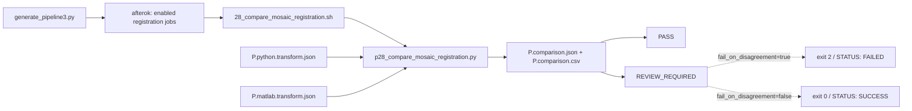

# 28 Python/Matlab Mosaic Registration 比较工作流逐块解读

> 本文按 `generate_pipeline3.py` 的 dependency 生成顺序、`28_compare_mosaic_registration.sh` wrapper、`p28_compare_mosaic_registration.py` runner 的源码执行顺序解读。本文只读说明代码，不修改业务脚本，也不把比较结果误解为 consensus transform。

---

## 📋 文档定位

Step 28 是 registration agreement check。它读取 Step 25 的 Python transform JSON 和 Step 26 的 Matlab transform JSON，验证两份文件的 schema、backend、quality、coordinate system 与输入 identity，然后计算两套 shift 的差异。

它只回答一个问题：两个独立 backend 对同一对输入图像是否给出足够接近的 translation。它不会：

- 重新读取原始 mosaic 做第三次 registration；
- 选择 Python 或 Matlab 作为“正确答案”；
- 平均两套 shift；
- 生成可以交给 Step 29 的 consensus transform。

Step 29 的应用仍然必须使用某一份已经通过 contract validation 的 backend transform。Step 29 的具体执行说明见 [`29_apply_mosaic_transform_workflow.md`](29_apply_mosaic_transform_workflow.md)。

## 🔗 Runtime call chain



如果 25/26 都启用，generator 会让 28 等待两个 job；如果只启用 28，generator 不会自动补交 25/26，28 wrapper 只检查两份 JSON 是否已经预先存在。

## ⚙️ Config/generator entry

### 开关与输入文件

`generate_pipeline3.py:255-279` 读取 `run_mosaic_registration_compare`，`batch_config.example.ini:102-113` 中它默认是 `false`。共同输出 prefix 与比较参数位于 `batch_config.example.ini:494-529`：

| 配置项 | Step 28 语义 |
| --- | --- |
| `mosaic_registration_output_prefix` | 生成 `P.comparison.json/csv` 的 prefix |
| `mosaic_registration_agreement_tolerance_px` | 欧氏 shift 差异允许的最大像素值，默认 `0.5` |
| `mosaic_registration_fail_on_disagreement` | disagreement 是否让 job 返回失败，默认 `true` |
| `mosaic_registration_overwrite` | 是否允许覆盖比较结果 |
| `mosaic_registration_conda_env` | 运行比较 Python 的 environment |
| `mosaic_registration_compare_*` | Step 28 SLURM partition、CPU、memory |

### generator 确定输入文件名：`466-476`

generator 不从配置中单独读取两份 JSON 路径，而是根据相同的 output prefix 确定：

```python
mosaic_registration_compare_args = format_named_args((
    ('python_json',
     f"{p['mosaic_registration_output_prefix']}.python.transform.json"),
    ('matlab_json',
     f"{p['mosaic_registration_output_prefix']}.matlab.transform.json"),
    ('output_prefix', p['mosaic_registration_output_prefix']),
    ('agreement_tolerance_px', p['mosaic_registration_agreement_tolerance_px']),
    ('fail_on_disagreement', p['mosaic_registration_fail_on_disagreement']),
    ('script_dir', p['FovIntegration']),
    ('conda_env', p['mosaic_registration_conda_env']),
    ('overwrite', p['mosaic_registration_overwrite']),
    ('dry_run', 'false'),
))
```

因此 28 的输入契约是确定的：`P.python.transform.json` 与 `P.matlab.transform.json` 必须来自相同 `P`，且两者都应由对应 registration backend 生成。

### dependency 生成：`1020-1066`

generator 先保存 registration parent dependency，再分别提交 25/26：

```python
registration_parent_dependency = dependency_str
registration_job_vars = []

# enabled Python job and/or enabled Matlab job use registration_parent_dependency
# each submitted job ID is appended to registration_job_vars
```

如果有 registration job，`registration_dependency` 由这些 job ID 组成：

```python
registration_dependency = "--dependency=afterok:" + ":".join(
    f"${{{name}}}" for name in registration_job_vars
)
```

然后 Step 28 以该 dependency 提交：

```python
if run_mosaic_registration_compare:
    cmd_mosaic_compare = f"sbatch ... {registration_dependency} ..."
```

这表达的是 job-level ordering，而不是代码层面的 transform 合并。Step 28 只在前置 job 正常结束后被调度；Python runner 仍会重新读取并验证两个 JSON 的内容。

## 🧰 Wrapper 执行顺序：`28_compare_mosaic_registration.sh`

### 1. SLURM 资源与严格模式：`1-11`

```bash
#SBATCH -J mosaic_reg_compare
#SBATCH -o logs028_mosaic_registration/%x_%A.out
#SBATCH -e logs028_mosaic_registration/%x_%A.err
#SBATCH -p C64M256G
#SBATCH -N 1
#SBATCH -c 2
#SBATCH --mem=7G
#SBATCH --time=01:00:00

set -euo pipefail
```

比较只需要读取两个小型 JSON，因此资源为单节点、2 CPU、7G、1 小时。它不会重新读取或处理大型 TIFF mosaic。

### 2. usage、默认值和解析：`13-55`

帮助文本把三个输入/输出参数列在 Usage 中：

```text
--python_json FILE
--matlab_json FILE
--output_prefix PATH
```

默认值为：

| 参数 | 默认值 |
| --- | --- |
| `AGREEMENT_TOLERANCE_PX` | `0.5` |
| `FAIL_ON_DISAGREEMENT` | `true` |
| `CONDA_ENV` | `ashlar` |
| `OVERWRITE` | `false` |
| `DRY_RUN` | `false` |

解析循环将 `--agreement_tolerance_px`、`--fail_on_disagreement`、`--script_dir`、`--conda_env`、`--overwrite`、`--dry_run` 分别写入变量；未知参数直接失败。解析后要求 `PYTHON_JSON`、`MATLAB_JSON`、`OUTPUT_PREFIX` 都非空。

### 3. 输出路径与命令数组：`56-60`

```bash
SCRIPT="${SCRIPT_DIR}/p28_compare_mosaic_registration.py"
OUTPUT_JSON="${OUTPUT_PREFIX}.comparison.json"
OUTPUT_CSV="${OUTPUT_PREFIX}.comparison.csv"
COMMAND=(
    python -u "$SCRIPT"
    --python_json "$PYTHON_JSON"
    --matlab_json "$MATLAB_JSON"
    --output_json "$OUTPUT_JSON"
    --output_csv "$OUTPUT_CSV"
    --agreement_tolerance_px "$AGREEMENT_TOLERANCE_PX"
    --fail_on_disagreement "$FAIL_ON_DISAGREEMENT"
    --overwrite "$OVERWRITE"
)
```

wrapper 只把 output prefix 展开为 `.comparison.json` 和 `.comparison.csv`。它不会产生 `.consensus.transform.json`，也不会改写任一 backend transform。

### 4. 命令打印、dry-run 与输入检查：`61-64`

wrapper 先打印 `%q` 转义后的完整 command。`--dry_run true` 时打印后直接退出 0，不检查输入 JSON、不激活 conda，也不写 output。

非 dry-run 时检查两份 JSON 和比较 runner 存在，再创建 output prefix 的父目录。输入 JSON 的 schema 内容由 Python runner 检查，shell wrapper 不复制一套 JSON schema 校验。

### 5. 环境、退出 trap、输出检查：`65-73`

```bash
trap 'exit_code=$?; if [[ $exit_code -ne 0 ]]; then
    echo "STATUS: FAILED | SLURM_JOB_NAME=${SLURM_JOB_NAME:-N/A}"
fi' EXIT
source "/gpfs/share/home/${USER}/anaconda3/etc/profile.d/conda.sh"
set +u
conda activate "$CONDA_ENV"
set -u
"${COMMAND[@]}"
[[ -s "$OUTPUT_JSON" && -s "$OUTPUT_CSV" ]] || {
    echo "Error: comparison outputs missing" >&2
    exit 1
}
echo "STATUS: SUCCESS | SLURM_JOB_NAME=${SLURM_JOB_NAME:-N/A}"
```

这里要区分 runner 的业务 exit code 与 wrapper 的最终状态：`p28_compare_mosaic_registration.py` 在 disagreement 且 `fail_on_disagreement=true` 时返回 2，因 `set -e` wrapper 触发失败 trap；但如果 runner 已经写出 comparison files，文件仍然可能存在。wrapper 的 `STATUS: SUCCESS` 只有在 runner 返回 0 且两个输出非空时才会出现。

## 🧮 Python runner 执行顺序：`p28_compare_mosaic_registration.py`

### 1. schema 常量与 coordinate system：`1-35`

runner 固定：

```python
SCHEMA_NAME = "starfinder_translation_registration"
SCHEMA_VERSION = "1.1"
```

`IDENTITY_FIELDS` 要求每个 reference/moving identity 至少包括：

```text
image, height_px, width_px, dtype, size_bytes, mtime_epoch_s
```

`EXPECTED_COORDINATE_SYSTEM` 要求两份 transform 都使用 `xy`、pixel、zero-based、图像列向右/图像行向下，并使用：

```text
x_ref = x_moving + shift_x_px
```

因此比较的前提不仅是两个 shift 数字，还包括两个 backend 是否使用同一坐标合同。

### 2. boolean 与 image identity 验证：`37-91`

`parse_bool()` 统一解析 `fail_on_disagreement` 与 `overwrite`。`_validate_image_identity()` 逐项检查：

1. 所有 identity fields 都存在。
2. `image` 是非空绝对路径。
3. height/width 是正整数。
4. size/mtime 是非负整数。
5. dtype 是非空字符串。

`_validated_identity()` 在此基础上继续检查：

| 检查 | 要求 |
| --- | --- |
| schema | name=`starfinder_translation_registration`，version=`1.1` |
| transform | `translation_2d`、`moving_to_reference` |
| coordinate | 完全等于 `EXPECTED_COORDINATE_SYSTEM` |
| backend | 当前输入必须等于 expected `python` 或 `matlab` |
| quality | status 必须是 `PASS` |
| shift | x/y 都必须 finite |

函数最后返回 identity pair 与 shift x/y；此时还没有比较数值差异。

### 3. identity 对齐与差异计算：`94-132`

`compare_transforms()` 先以 expected backend 分别验证 Python 和 Matlab JSON：

```python
python_identity, python_shift_x, python_shift_y = _validated_identity(
    python_result, "python"
)
matlab_identity, matlab_shift_x, matlab_shift_y = _validated_identity(
    matlab_result, "matlab"
)
if python_identity != matlab_identity:
    raise ValueError("Python and Matlab transforms refer to different inputs")
```

只有两个 identity tuple 完全相等，才计算：

```python
delta_x = matlab_shift_x - python_shift_x
delta_y = matlab_shift_y - python_shift_y
euclidean = math.hypot(delta_x, delta_y)
agreement = "PASS" if euclidean <= agreement_tolerance_px else "REVIEW_REQUIRED"
```

差异方向被定义为 `Matlab - Python`，但 agreement 判定使用绝对意义上的欧氏距离。结果包含两套原始 shift、两个 delta、欧氏距离、阈值和状态；没有任何 consensus shift 字段。

### 4. CLI 参数：`135-144`

`build_parser()` 要求：

```text
--python_json
--matlab_json
--output_json
--output_csv
```

可选参数为 `--agreement_tolerance_px`、`--fail_on_disagreement` 和 `--overwrite`。这与 wrapper 传入的 command 一一对应。

### 5. 输出与 exit code：`147-188`

`main()` 的实际顺序是：

1. 解析 CLI。
2. 检查 comparison JSON/CSV 是否已存在；不允许覆盖时先失败。
3. 创建 output parent。
4. 读取并 `json.loads()` 两份 backend transform。
5. 调用 `compare_transforms()`。
6. 写格式化 JSON。
7. 将嵌套 result 展平成一行 CSV。
8. 打印 `Comparison status: ...`。
9. disagreement 且 `fail_on_disagreement=true` 时返回 2。

```python
args.output_json.write_text(json.dumps(result, indent=2, allow_nan=False) + "\n")
...
print(f"Comparison status: {result['agreement_status']}")
if result["agreement_status"] != "PASS" and args.fail_on_disagreement:
    return 2
return 0
```

这里有一个重要顺序：comparison JSON/CSV 在返回 2 之前已经写出。因此 `REVIEW_REQUIRED` 是一个有记录的分析结果；是否把它升级为 job failure，由 `fail_on_disagreement` 控制。

## 📦 输入、输出与状态契约

### 输入文件

以公共前缀 `P` 为例：

```text
P.python.transform.json
P.matlab.transform.json
```

两份文件必须：

- 使用相同 schema version `1.1`；
- 分别标记 backend `python` 和 `matlab`；
- quality status 都是 `PASS`；
- 使用相同 coordinate system；
- 绑定完全相同的 fixed/reference 与 moving identity；
- 包含 finite `shift_x_px` 与 `shift_y_px`。

### 输出文件

```text
P.comparison.json
P.comparison.csv
```

JSON 保存完整比较对象，CSV 保存扁平化字段，包括两套 shift、delta、欧氏差异、阈值和 agreement status。

### 状态矩阵

| agreement | `fail_on_disagreement` | runner exit | wrapper 状态 |
| --- | --- | --- | --- |
| `PASS` | true/false | `0` | `STATUS: SUCCESS` |
| `REVIEW_REQUIRED` | `true` | `2` | `STATUS: FAILED`，但 comparison files 已写出 |
| `REVIEW_REQUIRED` | `false` | `0` | `STATUS: SUCCESS`，但文件状态保留为 review |
| 输入/schema/identity 错误 | 任意 | 非零异常 | `STATUS: FAILED` |

`STATUS: SUCCESS` 在 `fail_on_disagreement=false` 时只表示“比较任务完成并允许继续”，不表示两个 backend 已经达成数值一致。

## ⚠️ 不生成 consensus transform

Step 28 的输出 schema 是：

```text
starfinder_translation_registration_comparison / 1.0
```

它与 backend transform schema `starfinder_translation_registration / 1.1` 不同。Step 28 输出中的 `python` 与 `matlab` 子对象保存两套 shift，不存在 `transform.shift_x_px` 这样的单一 consensus 字段。

所以后续 Step 29 不能把 `P.comparison.json` 当作 `--transform_json` 直接使用。Step 29 需要某一份合法的 `P.python.transform.json` 或 `P.matlab.transform.json`，并会再次校验输入 identity。Step 29 的应用流程见 [`29_apply_mosaic_transform_workflow.md`](29_apply_mosaic_transform_workflow.md)。

## 🔗 Cross-step contracts

- Step 25 负责产生 `P.python.transform.json`，并在本 job 内已经完成一份 Python backend application；详情见 [`25_register_mosaic_python_workflow.md`](25_register_mosaic_python_workflow.md)。
- Step 26 负责产生 `P.matlab.transform.json`，并在本 job 内完成一份 Matlab backend application；详情见 [`26_register_mosaic_matlab_workflow.md`](26_register_mosaic_matlab_workflow.md)。
- Step 29 可以独立 replay 某一份 backend transform，但不能直接应用 Step 28 的 comparison JSON；详情见 [`29_apply_mosaic_transform_workflow.md`](29_apply_mosaic_transform_workflow.md)。
- `tests/test_fov_integration_routes.py:206-266` 覆盖 25 only、26 only、25+26 parallel 后接 28 的 generator route；这些测试验证的是提交 dependency，不替代 p28 内容级 schema/identity validation。
- `tests/test_mosaic_registration.py:253-435` 覆盖 identity、coordinate、backend contract；`:627-721` 覆盖资源、help 和 dry-run 链路。

## ✅ 读取本文件后的最短结论

Step 28 的完整逻辑是：

```text
等待已启用的 registration jobs
  -> 检查两份 backend transform JSON
  -> 检查 schema / coordinate / backend / PASS / identity
  -> 计算 Matlab - Python 的 x/y delta
  -> 计算 euclidean_delta_px
  -> 写 comparison JSON/CSV
  -> 根据 fail_on_disagreement 决定 exit 0 或 exit 2
```

它是一个“可追溯的双 backend 一致性检查”，不是第三个 registration backend，也不是 transform consensus 生成器。
