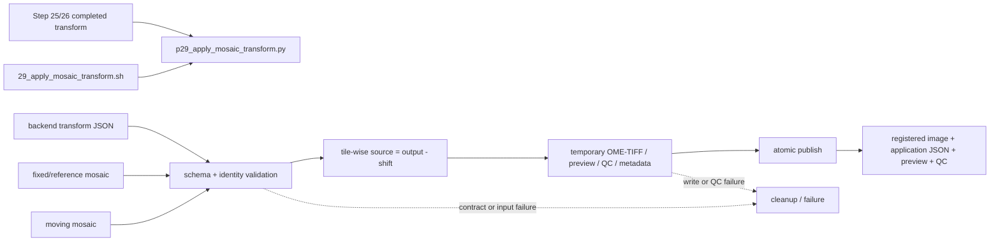

# 29 Mosaic Transform Application 工作流逐块解读

> 本文按两条 registration backend 在 job 内调用共享 runner、`29_apply_mosaic_transform.sh` 独立 replay wrapper，以及 `p29_apply_mosaic_transform.py` 的源码执行顺序解读。所有行号均对应当前源码；本文只读说明代码，不修改业务脚本。

---

## 📋 文档定位

Step 29 是统一的 transform application 功能层。它接收一份已经生成的 backend transform JSON、fixed/reference mosaic 和 moving mosaic，严格验证 transform 与当前输入的身份及坐标合同，然后把 moving 以 `moving_to_reference` translation 反采样到 fixed canvas。

Step 29 有两种运行方式：

1. **被 Step 25/26 内部调用**：25/26 先完成对应 backend registration，再在同一个 SLURM job 中调用 `p29_apply_mosaic_transform.py`。这时输出 prefix 通常是 `P.python` 或 `P.matlab`，因此应用输出具有 backend-specific 命名。
2. **独立 replay**：手动提交 `29_apply_mosaic_transform.sh`，对已有合规 transform 重放 application。这个 wrapper 使用调用者传入的 output prefix，不自动添加 `.python` 或 `.matlab`。

Step 29 不重新估计 shift，也不读取 Step 28 comparison JSON 作为 transform。Step 28 的说明见 [`28_compare_mosaic_registration_workflow.md`](28_compare_mosaic_registration_workflow.md)。

## 🔗 Runtime call chain



## ⚙️ Config/generator entry

### 25/26 的内部调用

Step 25 和 Step 26 的 wrapper 都构造自己的 `APPLY_COMMAND`：

```text
backend transform JSON
  -> --transform_json
fixed mosaic
  -> --fixed_mosaic
moving mosaic
  -> --moving_mosaic
backend-specific output prefix
  -> five application/QC output paths
```

25 的 output prefix 由 `${OUTPUT_PREFIX}.python.*` 展开，26 由 `${OUTPUT_PREFIX}.matlab.*` 展开。两个 wrapper 都在 registration backend 成功返回后才调用 p29；因此 p29 接收的 transform 应当已经有 `quality.status = PASS`。

### 独立 wrapper 不由 generator 自动提交

`generate_pipeline3.py:255-279` 只读取：

```python
run_mosaic_registration_python
run_mosaic_registration_matlab
run_mosaic_registration_compare
```

没有独立的 `run_mosaic_transform_apply` flag。`batch_config.example.ini:102-113` 也没有对应 Step 29 开关。Step 29 shell 文件虽然在 `SCRIPT_DIR` 中可用，但独立 replay 需要手动提交并自行准备 `logs029_mosaic_registration` 的 SLURM 日志目录。

这两个入口的职责不能混为一谈：

| 入口 | output prefix | 典型用途 |
| --- | --- | --- |
| 25 内部 p29 | `P.python` | Python registration 后的完整应用结果 |
| 26 内部 p29 | `P.matlab` | Matlab registration 后的完整应用结果 |
| 29 独立 wrapper | 调用者提供的 `P` | 对既有 transform replay 或补做 application |

## 🧰 Wrapper 执行顺序：`29_apply_mosaic_transform.sh`

### 1. SLURM 资源与严格模式：`1-11`

```bash
#SBATCH -J mosaic_apply_transform
#SBATCH -o logs029_mosaic_registration/%x_%A.out
#SBATCH -e logs029_mosaic_registration/%x_%A.err
#SBATCH -p C64M256G
#SBATCH -N 1
#SBATCH -c 8
#SBATCH --mem=30G
#SBATCH --time=08:00:00

set -euo pipefail
```

独立 application 需要 8 CPU、30G、8 小时。严格模式确保 runner、输入检查或五项输出检查失败时不输出成功状态。

### 2. 帮助文本与参数默认值：`13-47`

帮助文本要求四个核心参数：

```text
--transform_json FILE
--fixed_mosaic FILE
--moving_mosaic FILE
--output_prefix PATH
```

其它默认值如下：

| 参数 | 默认值 | 作用 |
| --- | --- | --- |
| `--script_dir` | 当前 `02_FovIntegration` | 定位 p29 runner |
| `--conda_env` | `ashlar` | Python runtime |
| `--tile_size_px` | `1024` | tiled output 的边长 |
| `--interpolation_order` | `1` | `0` nearest，`1` linear |
| `--preview_downsample` | `16` | QC preview 下采样 |
| `--overview_block_px` | `4096` | QC overview source block |
| `--compression` | `zlib` | registered TIFF compression |
| `--overwrite` | `false` | 是否替换已有 output |
| `--dry_run` | `false` | 只打印 command |

### 3. 参数解析和 wrapper preflight：`48-69`

解析循环把四个 required 参数和 options 写入变量。结束后先检查四个核心值都非空，再限制：

```bash
[[ "$INTERPOLATION_ORDER" == "0" || "$INTERPOLATION_ORDER" == "1" ]] || {
    echo "Error: --interpolation_order must be 0 or 1" >&2
    exit 1
}
```

这里的插值限制与 p29 Python 内部的 `choices=(0, 1)` 和函数级检查重复但一致；wrapper 提前失败可以避免激活环境后才发现明显错误。

### 4. 输出路径和 command：`69-75`

独立 wrapper 根据调用者给的 prefix `P` 展开五个 output：

```bash
SCRIPT="${SCRIPT_DIR}/p29_apply_mosaic_transform.py"
REGISTERED_MOSAIC="${OUTPUT_PREFIX}.registered_moving.ome.tif"
APPLICATION_JSON="${OUTPUT_PREFIX}.application.json"
PREVIEW_TIF="${OUTPUT_PREFIX}.registered_moving.preview.tif"
QC_PNG="${OUTPUT_PREFIX}.registration_qc.png"
QC_PDF="${OUTPUT_PREFIX}.registration_qc.pdf"
```

与 25/26 不同，这里没有自动产生 `${OUTPUT_PREFIX}.python.*` 或 `${OUTPUT_PREFIX}.matlab.*`。随后 `COMMAND` 将所有输入、五个输出和 application 参数传给：

```bash
python -u "$SCRIPT"
```

### 5. dry-run、文件检查与环境：`76-85`

wrapper 打印完整 command。`--dry_run true` 时打印后直接退出 0，不检查 transform/input 文件、不激活 conda、不写输出。

真实运行时检查 transform JSON、fixed/moving mosaic 和 Python runner 都存在，创建 output parent，然后：

```bash
source "/gpfs/share/home/${USER}/anaconda3/etc/profile.d/conda.sh"
set +u
conda activate "$CONDA_ENV"
set -u
"${COMMAND[@]}"
```

独立 wrapper 没有像 25/26 那样显式导出 `OMP_NUM_THREADS` 和 `MKL_NUM_THREADS`；这只影响 wrapper 的环境设置，不改变 p29 的数据契约。

### 6. 五项输出检查与状态：`86-88`

runner 返回 0 后，wrapper 检查：

```text
registered_moving.ome.tif
application.json
registered_moving.preview.tif
registration_qc.png
registration_qc.pdf
```

每项必须非空，之后打印：

```text
STATUS: SUCCESS | SLURM_JOB_NAME=...
```

任何异常由 EXIT trap 打印：

```text
STATUS: FAILED | SLURM_JOB_NAME=...
```

## 🧮 Python runner 执行顺序：`p29_apply_mosaic_transform.py`

### 1. 共享依赖与合同常量：`1-43`

p29 从 p25 导入公共对象：

```python
from p25_register_mosaic_python import (
    SCHEMA_NAME,
    SCHEMA_VERSION,
    TiffWindowReader,
    build_overview,
    parse_bool,
)
```

这不是让 p29 再做 Python registration，而是复用：

- transform schema name/version；
- `TiffWindowReader` 的二维 TIFF/OME-TIFF 分块读取能力；
- QC overview 的分块构建逻辑；
- boolean CLI 解析。

本文件再次定义 `EXPECTED_COORDINATE_SYSTEM`，防止 application 接受不同 axis order、origin 或 translation formula 的 transform。

### 2. Transform contract 与输入 identity：`46-120`

`validate_transform_contract()` 按以下顺序拒绝不合规输入：

1. `schema_name` 必须等于 `starfinder_translation_registration`。
2. `schema_version` 必须等于 `1.1`。
3. `transform_type` 必须是 `translation_2d`。
4. `mapping` 必须是 `moving_to_reference`。
5. `coordinate_system` 必须完全等于预期合同。
6. `method.backend` 必须是 `python` 或 `matlab`。
7. `quality.status` 必须是 `PASS`。
8. transform 中 reference/moving image canonical path 必须分别等于当前 `--fixed_mosaic`/`--moving_mosaic`。
9. identity shape 必须等于当前 reader shape。
10. `_validate_file_identity()` 必须确认 dtype、size_bytes 和 mtime_epoch_s 都没有漂移。
11. `shift_x_px` 与 `shift_y_px` 必须 finite。

```python
if Path(reference.get("image", "")).resolve() != fixed_path.resolve():
    raise ValueError("Transform reference image does not match --fixed_mosaic")
if Path(moving.get("image", "")).resolve() != moving_path.resolve():
    raise ValueError("Transform moving image does not match --moving_mosaic")
```

这一步把 transform 与具体输入文件绑定起来。即使两个文件尺寸相同，只要 canonical path、文件大小或修改时间不一致，也不会继续 application。

### 3. 数组级 translation 与 dtype 处理：`123-157`

`apply_translation_array()` 是 preview 或测试可复用的数组级 helper。输出坐标先按 output shape 建立，再反向映射到 moving：

```python
y_coordinates = np.arange(output_height, dtype=np.float64) - float(shift_yx[0])
x_coordinates = np.arange(output_width, dtype=np.float64) - float(shift_yx[1])
yy, xx = np.meshgrid(y_coordinates, x_coordinates, indexing="ij")
sampled = ndimage.map_coordinates(
    moving_array,
    [yy, xx],
    order=interpolation_order,
    mode="constant",
    cval=0.0,
)
```

`scipy.ndimage.map_coordinates()` 使用：

| 参数 | 当前语义 |
| --- | --- |
| `order` | 只允许 `0` 或 `1` |
| `mode` | `constant` |
| `cval` | `0.0`，画布外填零 |
| `prefilter` | 当前 order 下为 false |

`_cast_to_dtype()` 对整数 dtype 先 round，再按 `np.iinfo` clip，最后 cast；浮点 dtype 则直接转换。

### 4. 分块采样单个输出 tile：`160-223`

大图 application 不直接调用整个数组，而是 `_tile_iterator()` 逐 tile 生成 output。每个 tile 由 `_sample_output_tile()` 完成：

1. 根据 output tile bounds 和 shift 反推 moving source bounds。
2. 对插值 order 加 halo。
3. 将 source bounds clip 到 moving image 范围。
4. 如果 tile 完全位于 moving 外部，直接返回全零 tile。
5. 读取所需 moving window。
6. 在 window 的局部坐标上执行 `map_coordinates`。
7. 转回 moving 原始 dtype。

核心关系是：

```text
source_y = output_y - shift_y
source_x = output_x - shift_x
```

因此 registered image 的输出 shape 与 fixed/reference 相同，moving 只被重新采样，不改变 fixed canvas 的尺寸。

### 5. 输出安全：`226-293`

`_canonical_path()` 统一解析绝对路径、符号链接和 realpath。`_ensure_outputs_available()` 在实际写入前执行多层保护：

| 检查 | 防止的问题 |
| --- | --- |
| output canonical path 去重 | 多个 output 参数指向同一文件 |
| output 与 protected input canonical path 比较 | output 覆盖 fixed/moving/transform input |
| 拒绝 symlink | 通过链接把写入导向未知位置 |
| 拒绝非 regular file | 输出路径是目录、设备等 |
| `samefile` 检查 | hard-link alias 绕过 canonical path 检查 |
| `overwrite=false` 检查 | 不意外替换已有结果 |

`publish_temp_file()` 的行为是：

- `overwrite=true`：`os.replace(temporary_path, output_path)`；
- `overwrite=false`：对临时文件创建 hard link 到目标，再删除临时文件。

这保证最终 output 不会在长时间写入过程中暴露半成品。

### 6. Registered OME-BigTIFF：`295-331`

`write_registered_mosaic()` 先用 `_unique_temp_path()` 在 output parent 创建临时文件，再调用 `tifffile.imwrite()`：

```python
    temporary_path,
    data=_tile_iterator(...),
    shape=(output_height, output_width),
    dtype=dtype,
    tile=(tile_size_px, tile_size_px),
    compression=compression,
    bigtiff=True,
    ome=True,
    photometric="minisblack",
    metadata={"axes": "YX"},
)
```

写入失败时立刻删除临时 TIFF。函数返回的是临时路径，而不是最终发布路径；最终发布由 main 的统一 publish 阶段完成。

### 7. QC preview 与图像诊断：`334-432`

`_normalize_for_display()` 只使用 finite positive pixels，按 1% 与 99.8% percentile 归一化到 `[0, 1]`；没有有效 positive pixels 时返回零数组。

`_write_qc_outputs()` 的顺序是：

1. 用 `build_overview()` 读取 fixed/moving preview。
2. 将 full-resolution shift 除以 preview downsample。
3. 在 fixed preview shape 上应用 translation 得到 registered preview。
4. 保存 registered preview TIFF。
5. 构造 fixed、moving before、registered、overlay、absolute difference 五个 panel。
6. 保存 PNG 与 PDF，PNG 使用 `dpi=300`。

overlay 的颜色约定是 fixed magenta、registered moving green；标题还记录 backend、shift、inlier ROI 数量和 spread，便于不打开 JSON 就能检查关键 QC 信息。

### 8. BBox 与 source bounds：`435-463`

`_valid_output_bbox()` 计算 moving 在 fixed canvas 内的有效输出边界。`_clipped_source_bounds()` 计算实际从 moving 读取的 source 范围。这两个结果不改变采样，只写入 application metadata，帮助下游理解画布外零填充和实际有效区域。

### 9. CLI 参数与输入 preflight：`465-518`

`build_parser()` 要求 transform JSON、fixed/moving 输入、五个 output 路径；可选 tile size、插值、preview、overview block、compression 和 overwrite。

`main()` 先检查：

```python
if args.tile_size_px < 16 or args.tile_size_px % 16 != 0:
    raise ValueError("tile_size_px must be a multiple of 16 and at least 16")
if args.preview_downsample < 1:
    raise ValueError("preview_downsample must be at least 1")
```

随后解析 fixed/moving/transform canonical path，调用 `_ensure_outputs_available()`，读取两个 TIFF 的 shape/dtype，再调用 `validate_transform_contract()`。只有所有 preflight 通过后才构造 metadata 和开始创建临时输出。

### 10. Application metadata：`519-552`

metadata 使用独立 schema：

```text
schema_name: starfinder_translation_application
schema_version: 1.0
mapping: moving_to_reference
```

它记录：

- 使用的 transform JSON、reference/moving image；
- 实际应用的 x/y shift；
- interpolation order、tile size、outside value、compression；
- registered output path、preview/QC 路径；
- fixed canvas shape 与 moving dtype；
- valid output bbox；
- clipped source bounds；
- `canvas_padding = constant_zero`。

这个 JSON 描述的是“transform 如何被应用”，不是新的 registration transform。

### 11. 临时输出、二次验证与原子发布：`553-609`

main 使用 `temporary_outputs` 记录五个最终 output 对应的临时路径：

1. 写 registered OME-BigTIFF 临时文件。
2. 创建 preview/QC 临时文件。
3. 写 application metadata 临时文件。
4. 再次调用 `validate_transform_contract()`，确认输入与 transform 在整个 application 期间仍符合合同。
5. 对五个 output 依次调用 `publish_temp_file()`。
6. 全部发布完成后打印 `Transform application PASS`。

```python
try:
    temporary_outputs[args.output_registered_mosaic] = write_registered_mosaic(...)
    # preview/QC/application metadata are written to temporary paths
    validate_transform_contract(...)
    for output_path in outputs:
        publish_temp_file(
            temporary_outputs[output_path],
            output_path,
            overwrite=args.overwrite,
        )
except Exception:
    for temporary_path in temporary_outputs.values():
        if os.path.lexists(temporary_path):
            temporary_path.unlink()
    raise
```

任何写入、QC、二次验证或 publish 失败都会清理已创建的临时文件，并且不会打印 PASS。只有五个 output 全部成功发布后，函数返回 0。

## 📦 输入、输出与失败契约

### 输入

一份可应用 transform 必须包含：

| 字段 | 要求 |
| --- | --- |
| schema | name `starfinder_translation_registration`，version `1.1` |
| transform | type `translation_2d`，mapping `moving_to_reference` |
| coordinate | 与 p25/p26 完全相同的 `xy`/zero-based 合同 |
| backend | `python` 或 `matlab` |
| quality | `status = PASS` |
| reference/moving | canonical path、shape、dtype、size、mtime identity |
| shift | finite `shift_x_px`、`shift_y_px` |

Step 28 的 `P.comparison.json` 不满足这个 transform schema，因此不能直接传给 `--transform_json`。

### 输出

对独立 wrapper 的 prefix `P`：

```text
P.registered_moving.ome.tif
P.application.json
P.registered_moving.preview.tif
P.registration_qc.png
P.registration_qc.pdf
```

25/26 内部调用时，这五个文件会分别带 `.python` 或 `.matlab` backend 前缀；这是调用方传入 prefix 的结果，不是 p29 runner 自己推断 backend 后追加的结果。

### 主要失败点

| 阶段 | 失败条件 | 保护结果 |
| --- | --- | --- |
| 参数 | 缺少四个 required 参数、插值不为 `0/1` | wrapper 退出 |
| 文件 | transform/fixed/moving/runner 缺失 | wrapper 退出 |
| output safety | duplicate、symlink、hard-link alias、input alias、已有文件未允许覆盖 | runner 退出 |
| transform contract | schema、backend、quality、coordinate、path、shape、dtype、size、mtime、shift 错误 | runner 退出 |
| sampling | tile size 非法、source window 越界或采样失败 | 临时文件清理 |
| QC | preview、matplotlib、PNG/PDF 写入失败 | 临时文件清理 |
| publish | 临时文件不是 regular file 或原子发布失败 | 临时文件清理，不发布半成品 |
| wrapper check | 五项输出任一不存在或为空 | `STATUS: FAILED` |

## 🔗 Cross-step contracts

- Step 25 的 p29 调用使用 `P.python.transform.json` 和 `.python.*` output；详情见 [`25_register_mosaic_python_workflow.md`](25_register_mosaic_python_workflow.md)。
- Step 26 的 p29 调用使用 `P.matlab.transform.json` 和 `.matlab.*` output；详情见 [`26_register_mosaic_matlab_workflow.md`](26_register_mosaic_matlab_workflow.md)。
- Step 28 只比较两份 backend transform，不产生可应用的 transform；详情见 [`28_compare_mosaic_registration_workflow.md`](28_compare_mosaic_registration_workflow.md)。
- `p25_register_mosaic_python.py:51-99` 提供 p29 复用的 `TiffWindowReader`，`p25_register_mosaic_python.py:101-161` 提供 p29 QC 使用的 `build_overview`，因此 p25 与 p29 的输入都遵守二维 TIFF/OME-TIFF 和分块读取假设。
- `tests/test_mosaic_registration.py:156-250` 验证 fixed-canvas application 和误差改善；`:253-435` 验证 identity/coordinate/backend contract；`:438-543` 验证 output safety；`:546-616` 验证插值限制；`:627-721` 验证 resource/help/dry-run 链路。

## ✅ 读取本文件后的最短结论

Step 29 不是 registration，而是一个有严格输入合同和原子输出保护的 application runner：

```text
读取 transform + fixed + moving
  -> 验证 schema / identity / PASS / finite shift
  -> 在 fixed canvas 上逐 tile 反向采样 moving
  -> 画布外填 0，保持 moving dtype
  -> 生成 registered OME-BigTIFF、preview、QC、application metadata 临时文件
  -> 二次验证并原子发布
  -> Transform application PASS
```

它真正保证的是“这份 transform 被安全地应用到了它声明的那一对输入图像上”，而不是保证 transform 本身来自哪一种 registration backend 或两个 backend 彼此一致。
