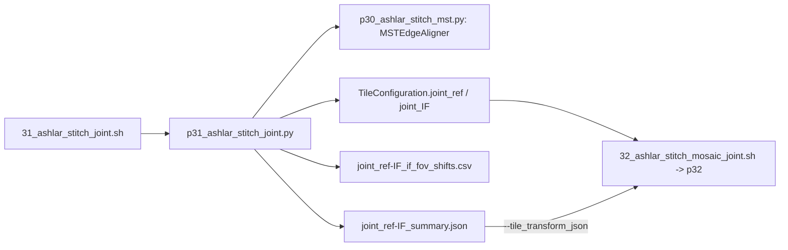

# 3x Joint ref + IF Stitching 工作流说明

> 3x 是在原有 Fiji（1x）和 Ashlar（2x）流程之外**新增**的一条流程，原有流程不受影响：
> - `30_ashlar_stitch_mst.sh` / `p30_ashlar_stitch_mst.py`：单轮 ashlar，采用 MST 选边、一致性检查、环路复核和全局 LSQ（可选，用于 QC 或 TE 等单轮拼接）；
> - `31_ashlar_stitch_joint.sh` / `p31_ashlar_stitch_joint.py`：把参考轮（ref round）和 IF 轮的 FOV 放进同一个 ashlar 拼接问题一起求解，输出同一坐标系下的两份 TileConfiguration；
> - `32_ashlar_stitch_mosaic_joint.sh` / `p32_ashlar_stitch_mosaic_joint.py`：按联合坐标出图。

---

## 📋 文档定位

3x 流程的思路是：**ref 轮定义统一坐标系，联合拼接把 IF 轮放进这个坐标系。** 原来需要三条路径才能覆盖的情况，用这一条路径都能处理：

| 原路径 | 涉及步骤 | 3x 中对应的部分 |
|---|---|---|
| 逐 FOV IF→ref 配准，再生成 moving 坐标 | `nuclei_reg` (11) + `prepare_moveimages` (23) | 跨轮边 + 逐 FOV 偏移表 |
| IF 自拼接 + 大图整体平移 | `pyreg`/`matreg`/`reg_compare`/`transform_apply` (25/26/28/29) | 粗定位 + 联合求解 |
| IF 独立拼接（仅作展示） | `*Independent` channel mode | IF–IF 边 |

3x IF 流程（ini 里打开这四步即可）：

```text
prepare_tile_config (12)   MAF -> TileConfiguration.initial.txt          （与原有流程共用）
prepare_layout      (21)   ref 轮 -> raw-refDAPI；IF 轮 -> raw-561-CA9 / raw-488-CD144 / raw-647-CD31 / raw-DAPI（与原有流程共用）
ashlar_joint_stitch (31)   -> TileConfiguration.joint_ref.txt + TileConfiguration.joint_IF.txt
ashlar_joint_mosaic (32)   ref 通道用 joint_ref；IF 通道用 joint_IF（加 IF tile 变换）
```

`ashlar_mst_stitch` (30) 不是必需步骤；需要单轮 mosaic 做检查，或拼 TE 等单轮数据时可以单独运行。

下游 reads 整合（`cellreads_registered_tile_config`）应使用 `TileConfiguration.joint_ref.txt`：转录本由 ref 轮 tile 的局部坐标加上 tile 位置得到，与蛋白图处在同一个坐标系。

## 🔗 Runtime call chain



## ⚙️ 算法

1. **读入**：ref 和 IF 各 N 个 FOV 的 MIP，名义坐标都来自 `TileConfiguration.initial.txt`。tile 只读一次，缓存后各遍复用。
2. **粗定位**：把两轮 FOV 都按名义坐标缩小 16 倍拼成低分辨率图，用 FFT 互相关得到 IF 相对 ref 的整体偏移 D。D 只用来把 IF FOV 放到它实际拍到的 ref 区域上方，以便找到跨轮邻居；精度要求是几十 px 以内。
3. **联合求解（第 1 遍）**：2N 个 tile 交给 `MSTEdgeAligner`（`tile_group = ref/IF`）。邻接图自动包含 ref–ref、IF–IF、ref|IF 三类边；一致性检查按 `ref-H`、`ref-V`、`IF-H`、`IF-V`、`ref|IF` 分组；之后做环路复核、MST 连通检查和全局加权 LSQ（稳健剔除残差 > 3 px 的非桥边）。
4. **旋转估计**：用第 1 遍自己的 ref–ref 和 IF–IF 边，分别求出两轮的单轮位置 P、Q，再用所有可信的跨轮边稳健拟合相似变换 `z_ref = a·z_IF + b`。
5. **旋转校正**：|旋转| > `rotation_threshold_mdeg`（默认 10 mdeg）时，每个 IF FOV 绕自身中心按 a 重采样（线性插值，无数据处填 0；ashlar 拼图时会在 0 值处保留相邻 tile 的数据），然后重新联合求解，迭代到旋转估计的变化 < 1 mdeg（最多 3 遍）。P、Q 只取自第 1 遍（tile 尚未旋转）。

只平移 tile 无法表示旋转：小旋转会摊到每条接缝上，大旋转（例如载玻片重新放置，> 1°）会让跨轮匹配整体失败。

## 📤 输出（写在 stitching workdir）

| 文件 | 内容 |
|---|---|
| `TileConfiguration.joint_ref.txt` | ref FOV 在统一坐标系中的位置（**统一坐标框架**） |
| `TileConfiguration.joint_IF.txt` | IF FOV 在同一坐标系中的位置 |
| `joint_ref-IF_if_fov_shifts.csv` | 逐 FOV 的 IF→ref 配准：`ref_y/x`、`if_y/x`、`shift_y/x = IF − ref`、`if_rotation_mdeg`、`if_tile_transform_applied`。替代原来的逐 FOV 配准偏移 |
| `joint_ref-IF_summary.json` | 粗定位偏移、各类边的残差统计、旋转/尺度估计、`if_tile_transform`（若做了校正）、两张画布的原点关系 `if_canvas_to_ref_canvas_yx` |
| `joint_ref-IF_edge_alignment.csv`（以及 `_pass1_*`） | 每条边的配准、分组、是否可信、LSQ 残差 |
| `joint_ref-IF_coordinates.csv` | 2N 个 FOV 的最终坐标 |

**画布对应**：direct stitch 会把每份 config 的最小坐标作为各自画布的原点，所以 `ref 画布像素 = IF 画布像素 + if_canvas_to_ref_canvas_yx`。

**IF 通道出图**：`32_ashlar_stitch_mosaic_joint.sh --tile_transform_json joint_ref-IF_summary.json`，json 里没有 `if_tile_transform` 时自动不做变换。

## 🔧 ini 配置（`batch_config.upstream.ini`）

```ini
run_prepare_tile_config = true
run_prepare_layout = true          ; ref 轮和 IF 轮都要放进同一个 stitching workdir
run_ashlar_joint_stitch = true
run_ashlar_joint_mosaic = true

ashlar_joint_stitch_stitching_workdir = 15_IFuint8_Fiji
ashlar_joint_stitch_ref_channel_dir = raw-refDAPI
ashlar_joint_stitch_if_channel_dir = raw-DAPI
ashlar_joint_stitch_input_config = TileConfiguration.initial.txt
ashlar_joint_stitch_rotation_threshold_mdeg = 10

ashlar_joint_mosaic_input_config = TileConfiguration.joint_IF.txt
ashlar_joint_mosaic_tile_transform_json = joint_ref-IF_summary.json
ashlar_joint_mosaic_ref_channel_dir = raw-refDAPI
ashlar_joint_mosaic_ref_input_config = TileConfiguration.joint_ref.txt

cellreads_registered_tile_config = TileConfiguration.joint_ref.txt
```

## ✅ 验证（GBM001–016，2026-10）

- 16 个样本全部连成一个整体。跨轮残差中位数 0.18–0.37 px；GBM006–009 约 1 px（IF 轮整体偏约 1.5 个 FOV，跨轮边都是半重叠，加上两轮视野内存在约 0.1% 的几何差异，按决定未做校正）。
- 边缘和中心的跨轮残差一致，没有随距离累积。
- GBM001/002 两轮之间旋转约 −1.35°，只有经过自动旋转校正才能对上；GBM003–009、015 的旋转为 26–58 mdeg，校正后接缝回到 0.15–0.38 px。
- 以上都是**自洽性指标**，不是 ground truth。和"使用两轮单轮拼接结果做粗定位与旋转估计"的早期实现相比：
  - 旋转估计一致（≤ 0.3 mdeg），跨轮残差相当或略低；
  - 但整个坐标系的绝对尺度有最多约 60 ppm 的差异（2.5 万 px 拼图边缘约 1–2 px），ref 与 IF 之间有约 0.3 px 的整体平移差异；
  - 这些差异在配准本身的不确定性范围内，不影响 ref↔IF 的对应关系。

## ⚠️ 注意

- 没有 ref 轮数据的样本无法使用这条流程。
- 稳健剔除只删除"非桥"边，不会造成 FOV 断连；但如果模型本身不对（例如旋转很大却没有校正），可能会成片删除跨轮边，此时应检查 summary 中 `ref|IF` 的 `lsq_removed` 数量。
